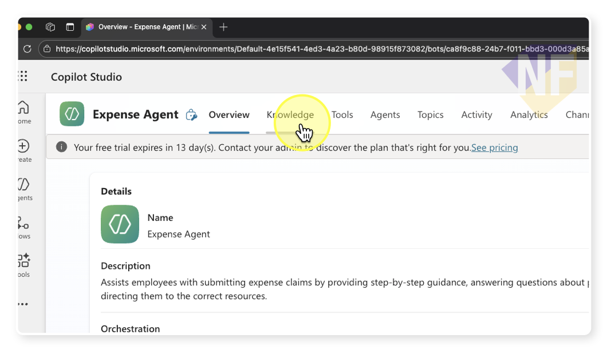
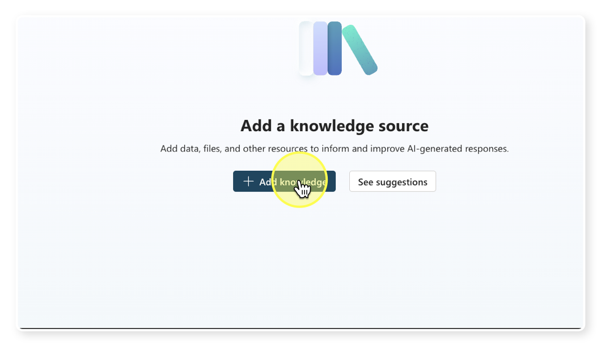
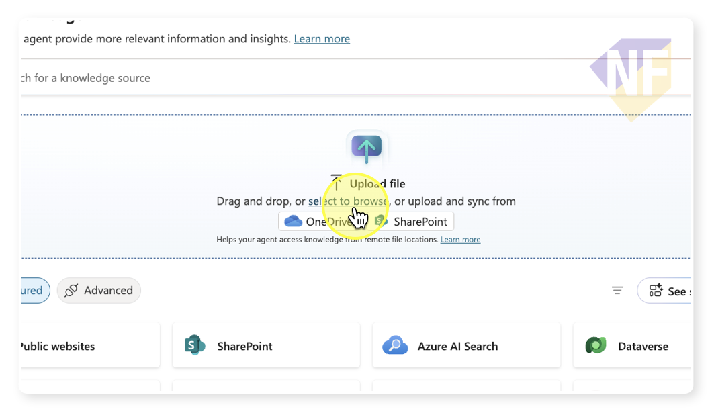
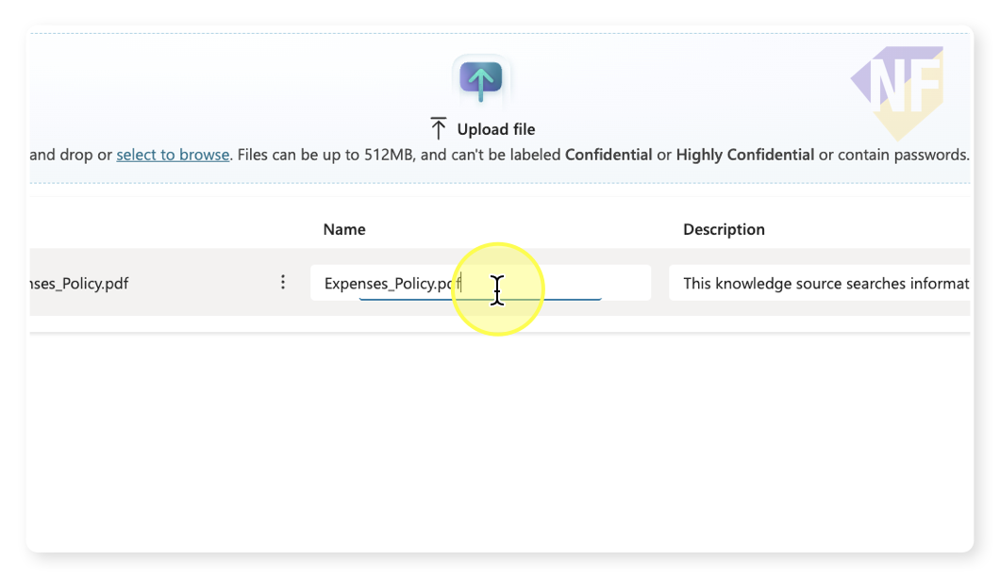
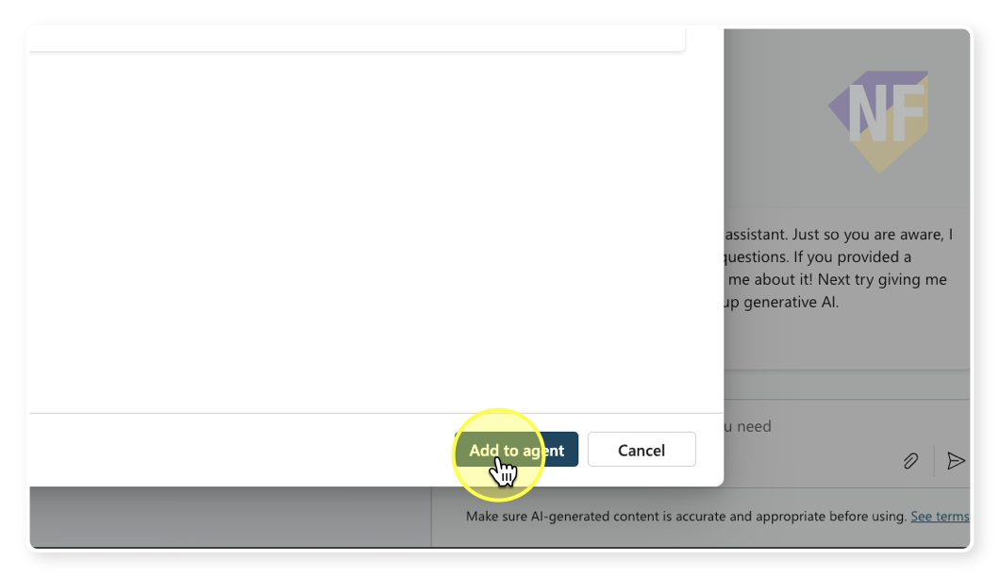
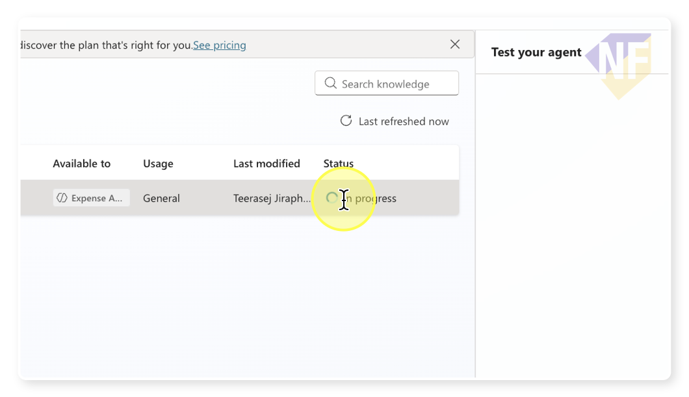

# Adding Knowledge to Agent

File ที่จะใช้ในการฝึกปฏิบัติ: [Expense_Policy.pdf](../../../files/Expenses_Policy.pdf)

## เพิ่มความรู้ให้กับ Agent ด้วยการอัปโหลดไฟล์ PDF

ในขั้นตอนนี้ คุณจะได้เรียนรู้วิธีการเพิ่มความรู้ให้กับ Agent โดยการอัปโหลดไฟล์เอกสาร เพื่อให้ Agent สามารถตอบคำถามจากข้อมูลในเอกสารได้

## 1. เตรียม Agent และเอกสาร

1. **เข้าสู่หน้าการตั้งค่า Agent**
   - เปิด Agent ที่คุณสร้างไว้แล้วใน [Copilot Studio Portal](https://copilotstudio.microsoft.com/)

2. **เตรียมไฟล์เอกสาร**
   - เตรียมไฟล์ PDF ที่มีข้อมูล เช่นในที่นี้เราจะใช้ไฟล์ PDF ชื่อ Expense_Policy.pdf (นโยบายการเบิกค่าใช้จ่าย)

## 2. เพิ่มความรู้ผ่าน Knowledge Tab

1. **ไปที่แท็บ Knowledge**
   - ที่แถบเมนูด้านบนของหน้า Agent ให้คลิกที่แท็บ **Knowledge** 
   - ระบบจะแสดงหน้าสำหรับจัดการแหล่งความรู้ของ Agent



1. **เลือกอัปโหลดไฟล์**
   - คลิกปุ่ม **"+ Add knowledge"**
  
   - เลือกตัวเลือก **"Upload files"** หรือ **"อัปโหลดไฟล์"**

2. **เลือกไฟล์ที่จะอัปโหลด**
   - คลิกปุ่ม **"Select to Browse"** 
  
   - เลือกไฟล์ PDF Expense Policy ที่คุณเตรียมไว้ [File ที่จะใช้ในการฝึกปฏิบัติ: [Expense_Policy.pdf](../../../files/Expenses_Policy.pdf)]
   - คลิก **"Open"** หรือ **"เปิด"** เพื่อยืนยันการเลือกไฟล์

3. **ยืนยันการอัปโหลด**
   - ตรวจสอบชื่อไฟล์ที่แสดงขึ้นมา และใส่รายละเอียดเพื่อเป็นประโยชน์สำหรับ Agent ในการอ้างอิง
  
   - คลิกปุ่ม **"Add to Agent"** เพื่อเริ่มการอัปโหลด
  

1. **รอให้การประมวลผลเสร็จสิ้น**
   
   - ระบบจะแสดงสถานะการอัปโหลดและการประมวลผลไฟล์ (ตรงนี้จะใช้เวลาสักครู่)
   - รอจนกว่าสถานะจะเปลี่ยนเป็น **"Ready"** 
   - กระบวนการนี้อาจใช้เวลาสักครู่ ขึ้นอยู่กับขนาดของไฟล์ และประเภทของแหล่งที่มาของ Knowledge 
  > อ้างอิงข้อมูลเพิ่มเติมเกี่ยวกับการเพิ่ม Knowledge ได้ที่: [Knowledge sources summary](https://learn.microsoft.com/en-us/microsoft-copilot-studio/knowledge-copilot-studio)

## 3. ทดสอบการทำงานของ Agent หลังเพิ่ม Knowledge 

1. **เริ่มทดสอบ Agent**
   - ไปที่แท็บ **Test** หรือพื้นที่แชทด้านขวาของหน้าจอ
   - เริ่มถามคำถามเกี่ยวกับข้อมูลใน Expense Policy เช่น
     ```
     "Waht is the maximum amount for meal reimbursement?"
     ```
   - กดปุ่มส่ง และรอให้ Agent ตอบกลับ

2. **ทดสอบคำถามเพิ่มเติม**
   - ลองถามคำถามอื่น ๆ ที่เกี่ยวข้องกับข้อมูลในเอกสาร เช่น
     ```
     What documents do I need to submit with my expense claim?
     ```
     หรือ
     ```
     How long does it take to process an expense claim?
     ```
   - สังเกตว่า Agent สามารถตอบคำถามจากข้อมูลในเอกสารที่อัปโหลดได้หรือไม่

3. **ตรวจสอบแหล่งอ้างอิง**
   - สังเกตว่า Agent จะแสดงแหล่งที่มาของข้อมูล (Citations) จากไฟล์ที่อัปโหลดหรือไม่
   - คุณสามารถคลิกที่แหล่งอ้างอิงเพื่อดูส่วนของเอกสารต้นฉบับได้

## สรุป

ตอนนี้คุณได้เรียนรู้วิธีการเพิ่มความรู้ให้กับ Agent โดยการอัปโหลดไฟล์เอกสาร ซึ่ง Agent จะสามารถใช้ข้อมูลจากเอกสารนั้นมาตอบคำถามของผู้ใช้ได้อย่างถูกต้องและมีแหล่งอ้างอิง


