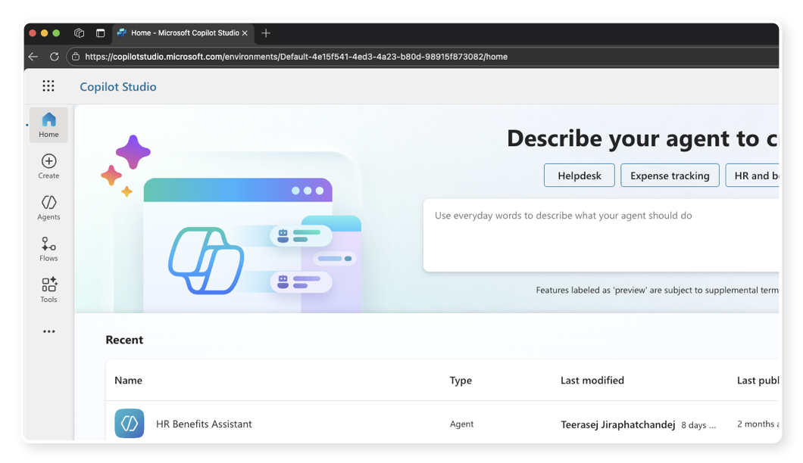
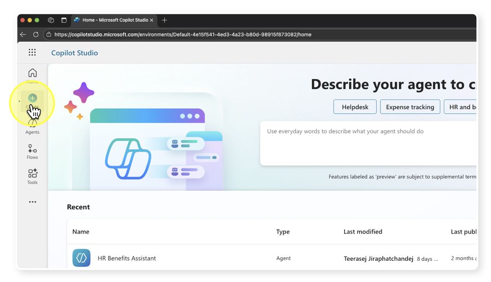
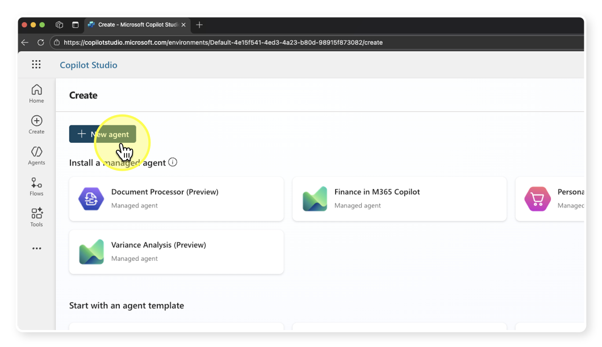
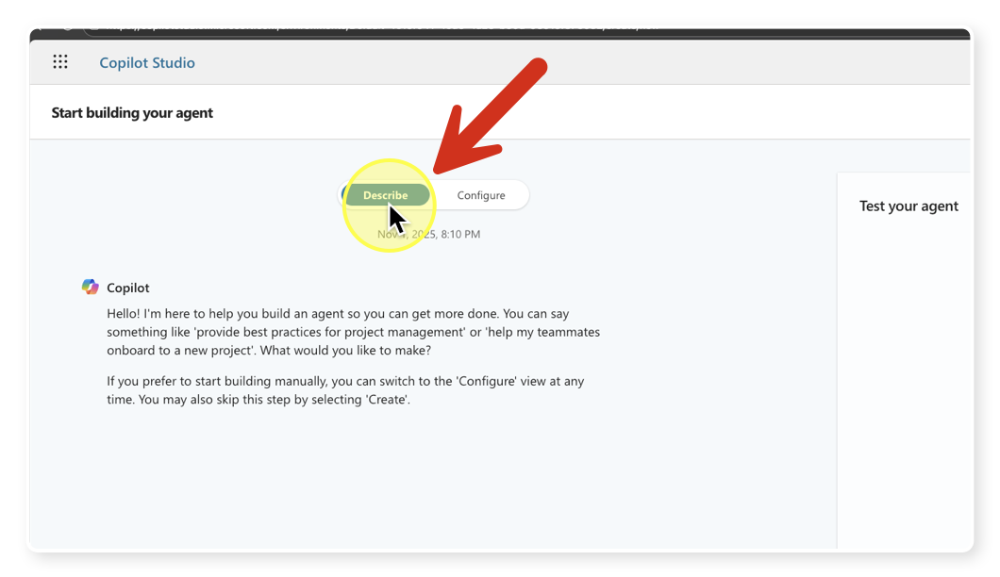
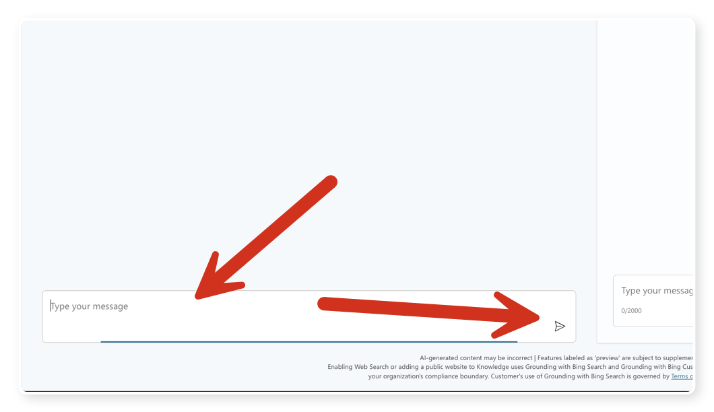
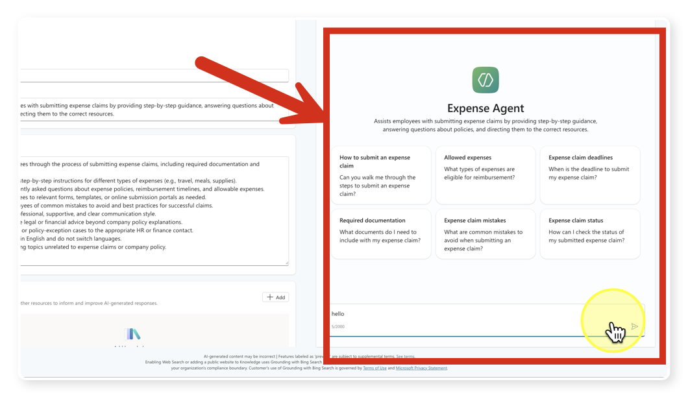
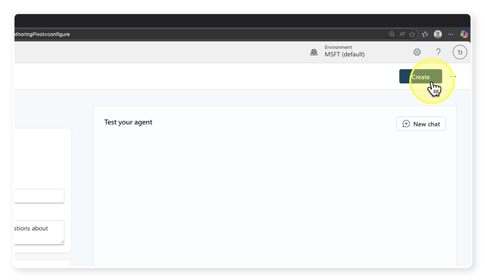

# สร้าง AI Agent ตัวแรกของเรา


## สร้าง Agent ใหม่ด้วย Copilot Studio Portal (Describe Mode)

1. **เข้าสู่ Copilot Studio Portal**
	- เปิดเว็บเบราว์เซอร์และไปที่ [Copilot Studio Portal](https://copilotstudio.microsoft.com/)
	- ลงชื่อเข้าใช้ด้วยบัญชี Microsoft ของคุณ


2. **ไปที่หน้า Create**
	- ที่แถบเมนูด้านซ้ายของ Portal ให้คลิกที่ **Create**
	- ระบบจะแสดงรายการ Agent ทั้งหมดที่คุณสามารถสร้างได้

3. **เริ่มสร้าง Agent ใหม่**
	- คลิกปุ่ม **"New agent"** หรือ **"สร้าง Agent ใหม่"** ที่มุมขวาบนของหน้า Agents


4. **ยืนยันว่าอยู่ในโหมด Describe**
	- เมื่อเริ่มต้นสร้าง Agent ใหม่ ระบบจะอยู่ในโหมด **Describe (อธิบาย)** โดยอัตโนมัติ
	- คุณสามารถเริ่มพิมพ์คำอธิบายเพื่อสร้าง Agent ได้ทันที


5. **กำหนดพฤติกรรม Agent**
   
	- ใส่คำอธิบายสั้น ๆ เกี่ยวกับหน้าที่หรือพฤติกรรมของ Agent เช่นในที่นี้เป็น
        ```
        You are a helpful assistant that provides information about Expense claim for employees.
        ```
	- กดปุ่มส่ง
	- ระบบจะส่งข้อความตอบรับการสร้าง scope การทำงานของ Agent และถามชื่อของ Agent

6. **กำหนดชื่อของ Agent**
	- หลังจากระบบขอชื่อ ให้พิมพ์ชื่อที่ต้องการสำหรับ Agent ของคุณตอบกลับ หรือจะใช้ชื่อที่ระบบเสนอมาก็ได้ เช่น
        ```
        [ชื่อเรา] Expense Claim Assistant
        ```
    - กดปุ่มส่ง และรอให้ระบบตอบรับ

7. **ปรับแต่ง เสริมเติมขอบเขตการทำงานเพิ่มเติม (ถ้าต้องการ)**
    - คุณสามารถเพิ่มรายละเอียดเพิ่มเติมเกี่ยวกับขอบเขตการทำงานของ Agent ได้ เช่น
        ```
        The assistant can help employees understand the process of submitting expense claims. Also it will denied other requests that is not invole in expense claims.
        ```
    - กดปุ่มส่งอีกครั้ง และรอให้ระบบตอบรับ 


## ทดสอบการทำงาน



1. **เริ่มทดสอบ Agent**
    - ให้สังเกตด้านขวาของหน้าจอ จะมีแถบพรีวิวตัว Agent ที่คุณสร้างขึ้น
    - พิมพ์คำถามหรือข้อความทดสอบลงในช่องแชท เช่น
        ```
        How can I submit my expense claim?
        ```
    - กดปุ่มส่ง และรอให้ Agent ตอบกลับ
    
2. **ทดสอบการเลี่ยงตอบคำถามตาม scope ที่กำหนด**
    - ลองพิมพ์คำถามที่อยู่นอกขอบเขตที่กำหนดไว้ เช่น
        ```
        What is the company holiday policy?
        ```
    - กดปุ่มส่ง และสังเกตว่า Agent จะปฏิเสธการตอบคำถามนี้อย่างไร

## ยืนยันการสร้าง Agent และไปที่หน้าการตั้งค่า

1. **สั่งสร้าง Agent**
	- ด้านบนขวา ให้คลิก **Create** หรือ **สร้าง**
    

2. รอให้ระบบประมวลผลและสร้าง Agent ของคุณ

3. **เข้าสู่หน้าการตั้งค่า Agent**
	- หลังจากสร้างเสร็จ ระบบจะนำคุณไปยังหน้าการปรับแต่งการทำงานของ Agent
	- ที่นี่คุณสามารถปรับแต่ง Agent เพิ่มเติมได้ตามต้องการ

> **สิ้นสุดขั้นตอนนี้ คุณจะมี Agent ใหม่และอยู่ที่หน้าการตั้งค่า Agent**

