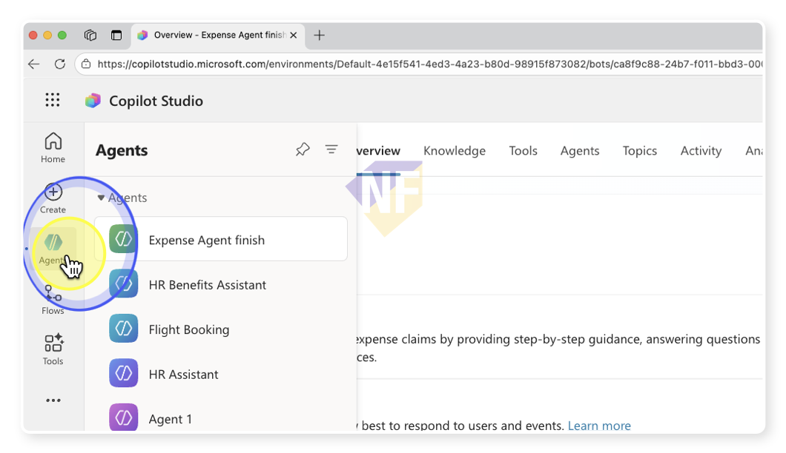
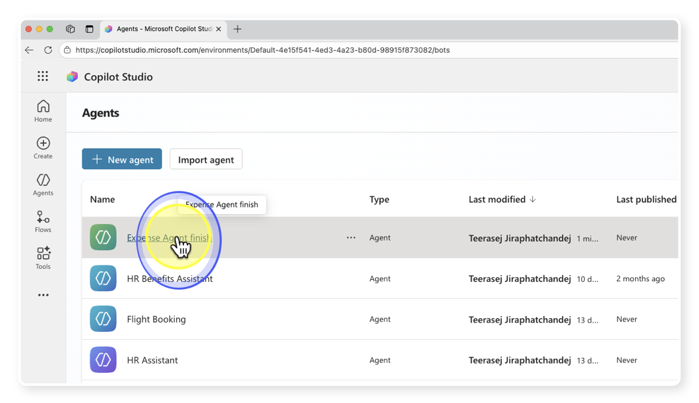
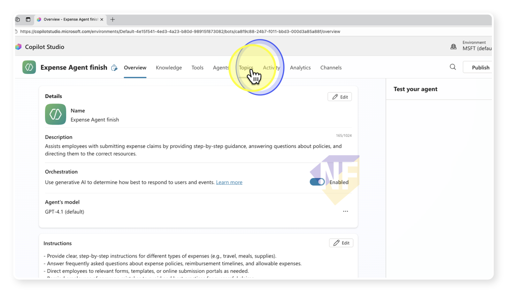
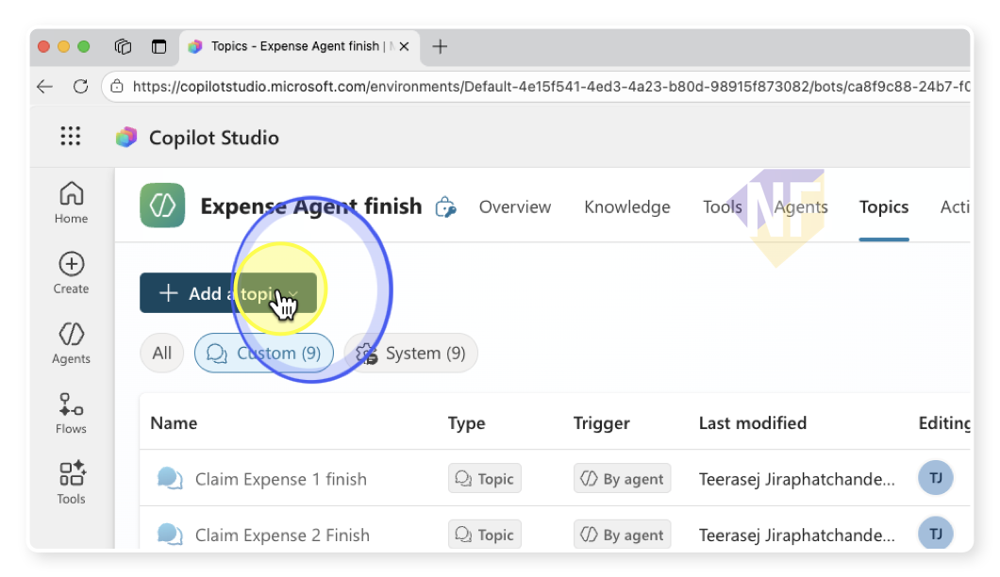
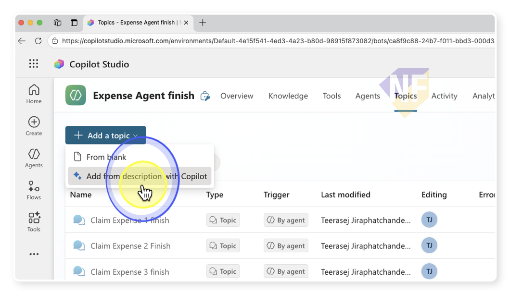
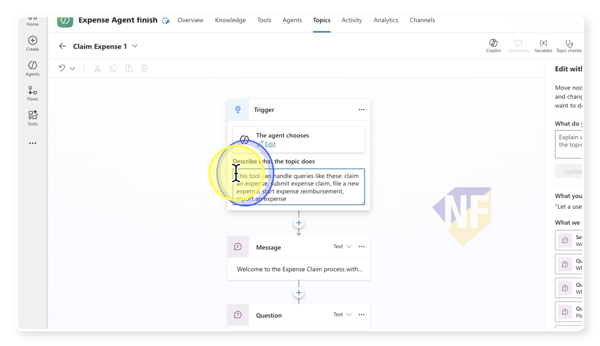
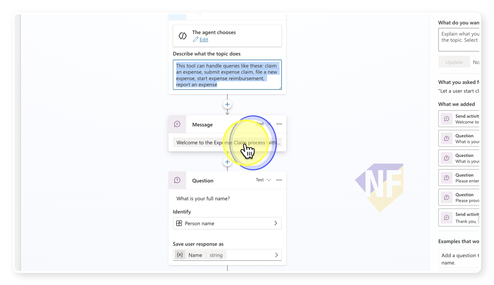
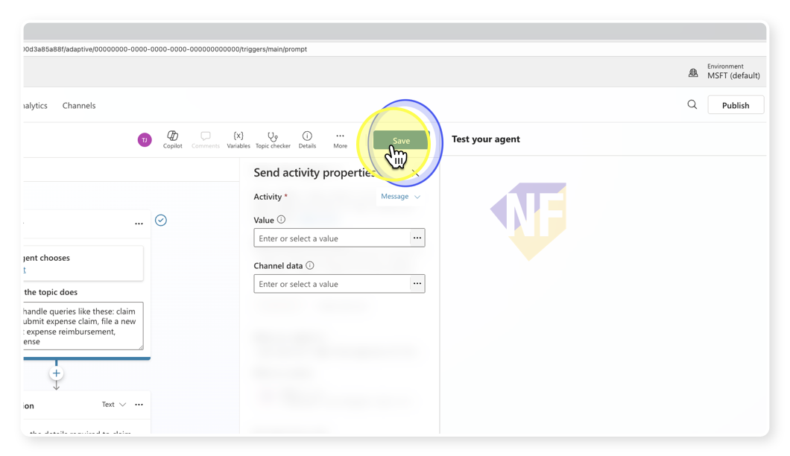
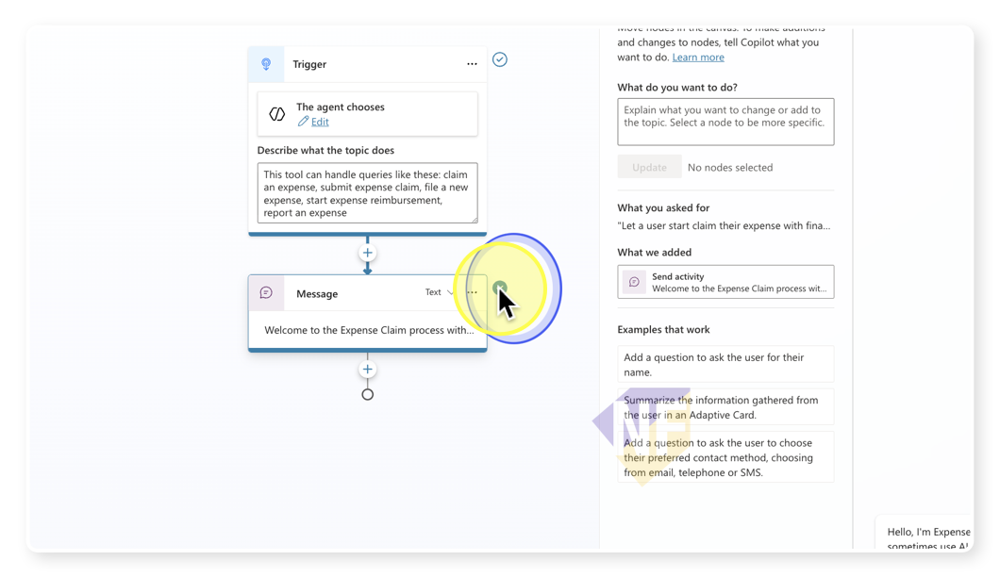

# Claim Expense 1: Create custom topics

แบบฝึกหัดนี้จะพาคุณใช้ Copilot เพื่อ “อธิบายแล้วให้ระบบสร้าง” Custom Topic สำหรับงานเริ่มต้นยื่นเรื่องเบิกค่าใช้จ่าย (Expense Claim) จากคำอธิบายสั้น ๆ แล้วตรวจทาน Trigger Phrases และ Nodes ที่ถูกสร้าง 


## ขั้นตอนการทำงาน


1. **เข้าสู่ Copilot Studio Portal**
    - เปิดเว็บเบราว์เซอร์และไปที่ [Copilot Studio Portal](https://copilotstudio.microsoft.com/)
    - ลงชื่อเข้าใช้ด้วยบัญชี Microsoft ของคุณ
    - เปิดเมนู Agent เพื่อแสดงรายการ Agent ที่มีอยู่
  

2. **เลือก Agent ที่ต้องการเพิ่ม Topic**
   - จากแถบซ้าย เลือก Agent ที่คุณสร้างไว้สำหรับงาน Expense Claim (ในที่นี้คือ Expense Agent)
  
  

1. **จากเมนูการจัดการ Agent ด้านบน ให้เลือก Topics**
   

2. **สร้าง Topic ใหม่**
	- คลิกปุ่มเพื่อสร้างหัวข้อใหม่ "Add topic”
  
	- เลือกโหมด "Add from description with Copilot”
  

1. **ระบุข้อมูลของ Topic เพื่อให้ Copilot ช่วยสร้างรายละเอียด**
	- Name: 
        ```
        Claim Expense 1
        ```
    - Description: 
        ```
        Let a user start claim their expense with financial department
        ```
    - กดปุ่ม **Create**

2. **ตรวจทาน Trigger Phrases**
	- หลังจาก Custom Topic ถูกสร้างขึ้นแล้ว ให้เลื่อนขึ้นมาที่ส่วน Trigger phrases ของ Topic 
	- ตรวจดูว่ามีคำที่ครอบคลุมกรณีใช้งานเริ่มต้นหรือไม่ เช่น:
	  - “start expense claim”
	  - “claim my expenses”
	  - “submit expense claim”
	- เพิ่ม/แก้ไข/ลบ Trigger ตามความเหมาะสม เพื่อให้ผู้ใช้เรียกหัวข้อนี้ได้แม่นยำขึ้น
  

3. **ตรวจทานโหนด (Nodes) ที่ Copilot สร้างให้**
	- สำรวจบนแผนที่/ผังการสนทนา ว่ามีโหนด Send a message, Ask a question หรือไม่
	- ผลลัพธ์ไม่จำเป็นต้องเหมือนกันเป๊ะ แต่ควรมีโครงสร้างหลัก เช่น โหนดเริ่มต้น (Start) ที่เชื่อมไปยังโหนดอื่นๆ 
  

4. **บันทึก (Save) ทดสอบหัวข้อ**
    - กดปุ่ม Save ที่มุมขวาบนเพื่อบันทึกการเปลี่ยนแปลงของ Topic
  

5. **ทดสอบการทำงานของ Topic**
	- เปิดแผงทดสอบ (Test pane) ด้านขวา และกดปุ่ม start new test session ถ้าต้องการ
	- ทดสอบพิมพ์ prompt ที่มีคำเกี่ยวข้องกับ Trigger ของ Topic นี้เช่น
        ```
        I want to start expense claim
        ```
        ```
        claim
        ```
        ```
        เบิก
        ```
	- สังเกตการทำงานของบทสนทนา และดูเส้นทางที่ถูกไฮไลท์บนแผนที่ (Conversation Map) ว่าตัว Agent มีการเรียกใช้ Topic ของเราหรือไม่
        

