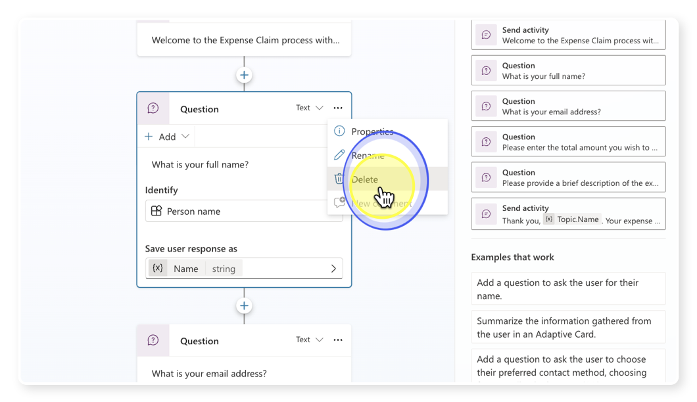
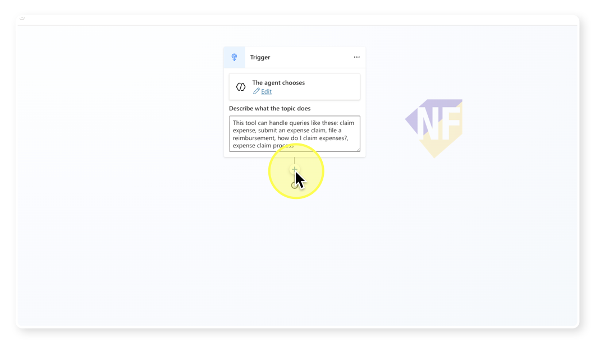
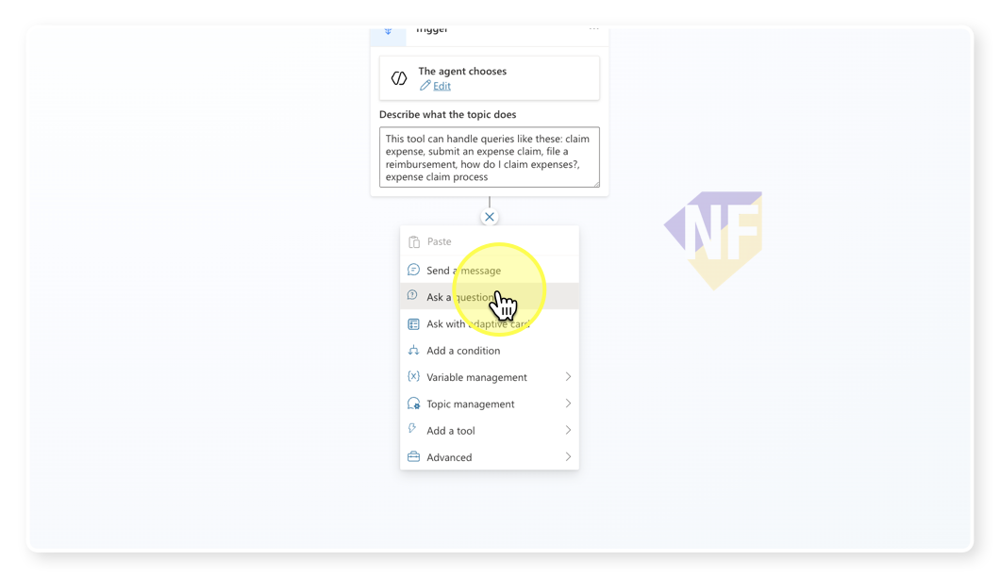
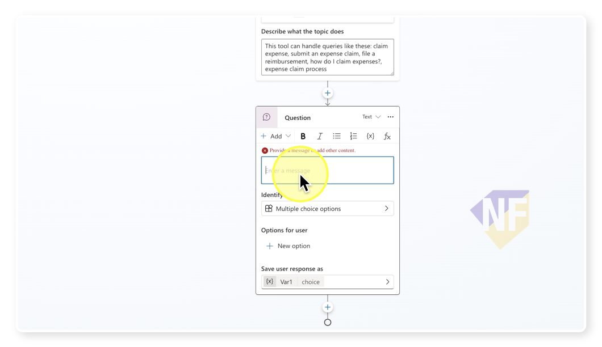
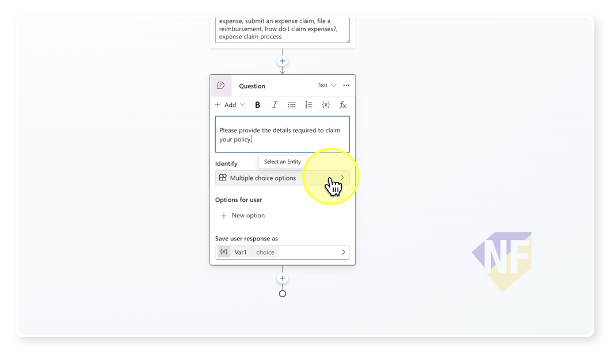
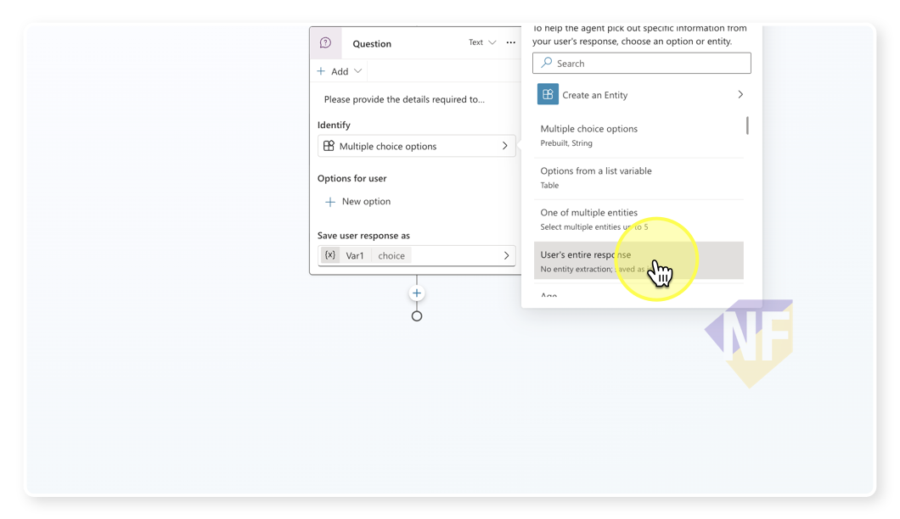
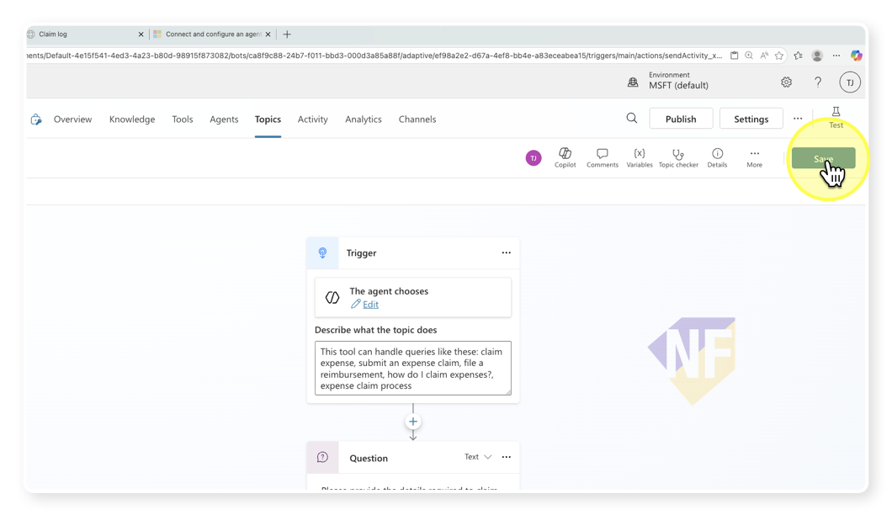
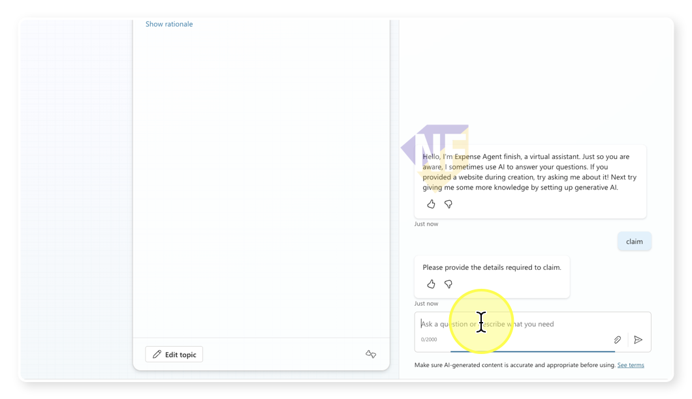

# Claim Expense 1: Modifying Topic Nodes


## ขั้นตอนการทำงาน


1. **เข้าสู่ Copilot Studio Portal**
    - เปิดเว็บเบราว์เซอร์และไปที่ [Copilot Studio Portal](https://copilotstudio.microsoft.com/)
    - ลงชื่อเข้าใช้ด้วยบัญชี Microsoft ของคุณ
    - เปิดเมนู Agent เพื่อแสดงรายการ Agent ที่มีอยู่

2. **เลือก Agent และ Topic**
   - จากแถบซ้าย เลือก Agent ที่คุณสร้างไว้สำหรับงาน Expense Claim (ในที่นี้คือ Expense Agent)
   - จากแถบเมนู เลือก Topic ที่คุณสร้างไว้สำหรับงาน Expense Claim (ในที่นี้คือ Claim Expense 1)

3. **ลบ Topic ที่ไม่ต้องการออก**
    - เลือกโหนด (Node) ที่ต้องการลบ
    - คลิกปุ่ม **More (...)** และเลือก **Delete** เพื่อลบโหนดนั้นออก
  

4. **ลบทุก Node ให้เหลือแค่ Trigger**
    
5. **จากด้านล่างของ Trigger node กดปุ่ม + เพื่อเพิ่มโหนดใหม่ดังนี้**
   
    - เลือกโหนด **Ask a question**
  
    - ตั้งชื่อ Question Node เป็น:
        ```
        Get Claim Details
        ```
    - ใส่ข้อความดังนี้:
        ```
        Please provide the details required to claim your policy.
        ```
        
    - ในส่วนของ **Identify** ให้กดเปิดรายการประเภทของคำตอบ
      
    - เลือก **User entire response**
      
    ```

6. **จากด้านล่างของ Question Node เราจะเพิ่ม node เพื่อแสดงข้อความ**
    - กดปุ่ม + เพื่อเพิ่มโหนดใหม่
    - เลือกโหนด **Send a message**
    - ตั้งชื่อ Message Node เป็น:
        ```
        Claim Summary
    - ใส่ข้อความดังนี้: 
        ```
        Thank you for providing your details. Here is your claiming:
        ```


1. **บันทึก (Save) ทดสอบหัวข้อ**
    - กดปุ่ม Save ที่มุมขวาบนเพื่อบันทึกการเปลี่ยนแปลงของ Topic
      

1. **ทดสอบการทำงานของ Topic**
    - เปิดแผงทดสอบ (Test pane) ด้านขวา และกดปุ่ม **start new test session** ถ้าต้องการ
    - ทดสอบพิมพ์ prompt ที่มีคำเกี่ยวข้องกับ Trigger ของ Topic นี้เช่น
        ```
        I want to start expense claim
        ```
        ```
        claim
        ```
        ```
        เบิก
        ```
    - สังเกตการทำงานของบทสนทนา และดูเส้นทางที่ถูกไฮไลท์บนแผนที่ (Conversation Map) ว่าตัว Agent มีการเรียกใช้ Topic ของเราหรือไม่
    - พิมพ์รายละเอียดใดก็ได้เพื่อตอบคำถาม เช่น
        ```
        I want to claim my travel expenses for last month, totaling $500.
        ```
    - ตรวจสอบว่า Agent ตอบกลับด้วยข้อความสรุปที่เราตั้งไว้
        
