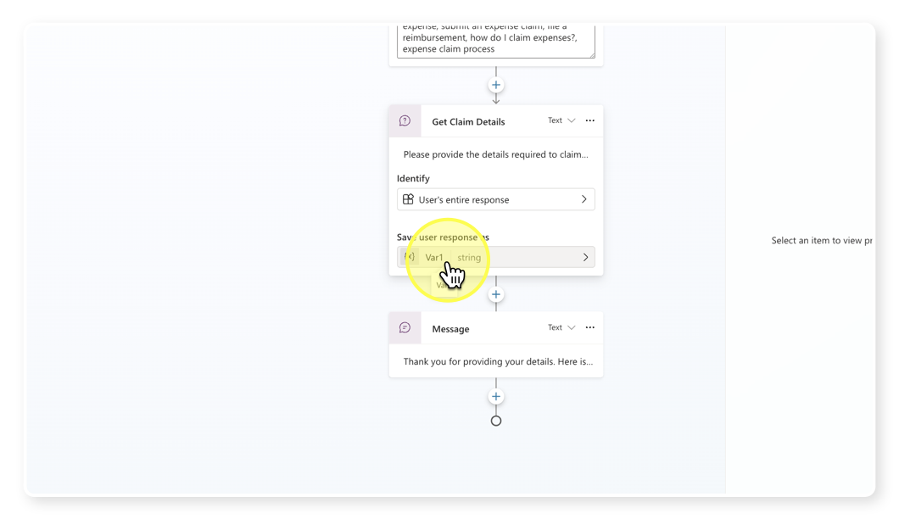
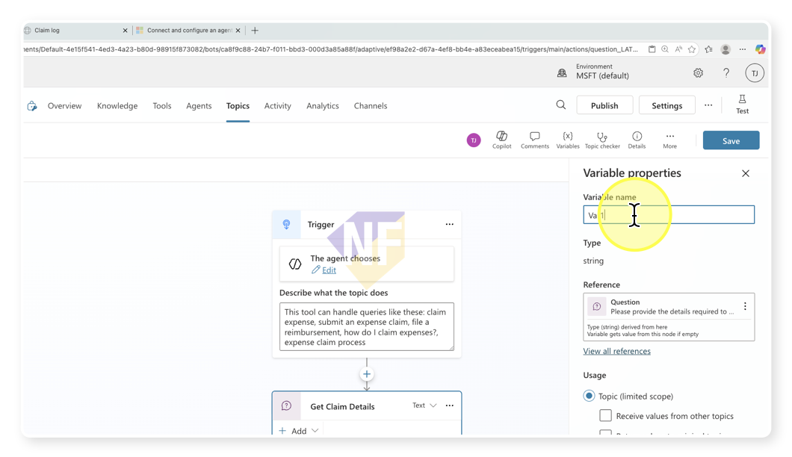
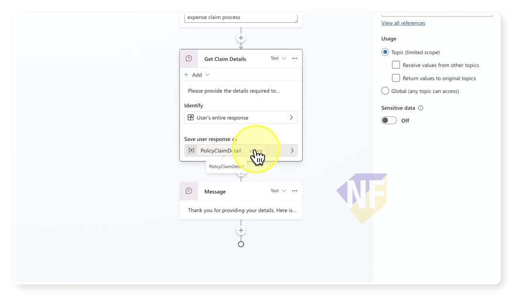
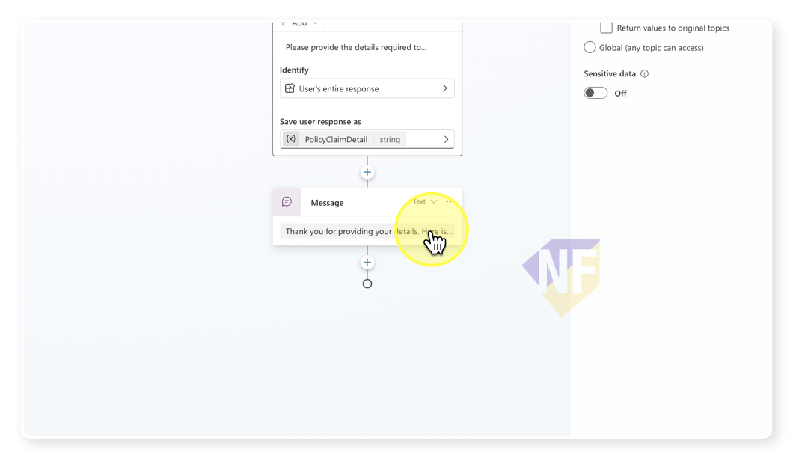
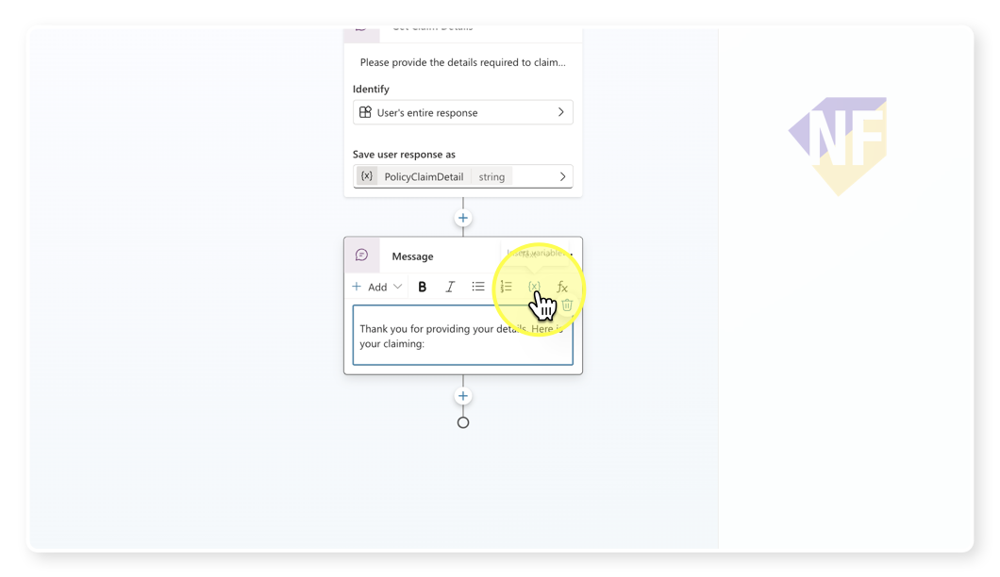
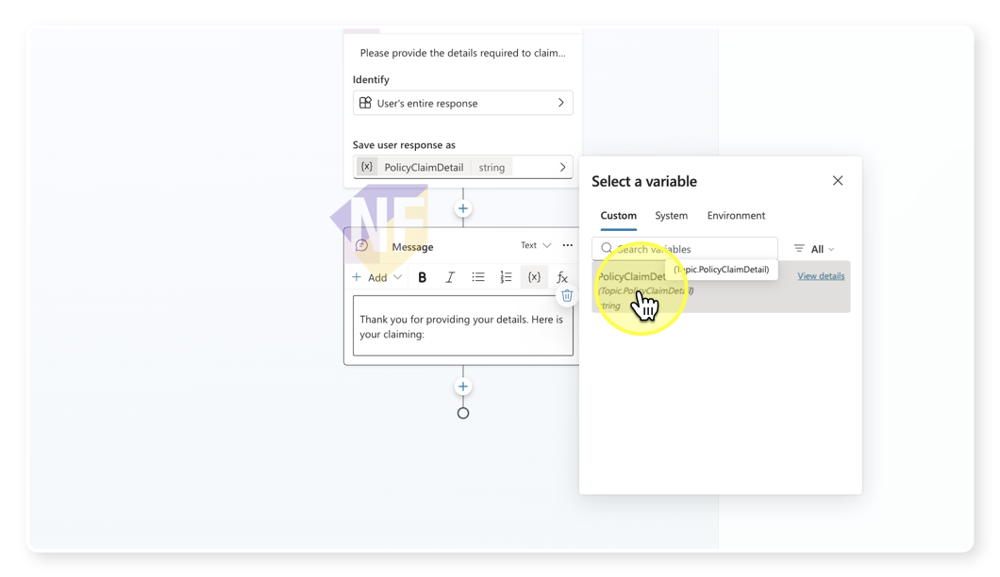
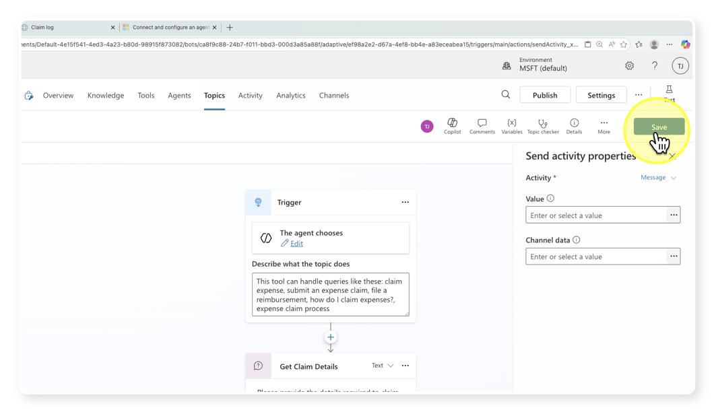

# Claim Expense 1: Create and using variables


## ขั้นตอนการทำงาน


1. **เข้าสู่ Copilot Studio Portal**
    - เปิดเว็บเบราว์เซอร์และไปที่ [Copilot Studio Portal](https://copilotstudio.microsoft.com/)
    - ลงชื่อเข้าใช้ด้วยบัญชี Microsoft ของคุณ
    - เปิดเมนู Agent เพื่อแสดงรายการ Agent ที่มีอยู่

2. **เลือก Agent และ Topic**
   - จากแถบซ้าย เลือก Agent ที่คุณสร้างไว้สำหรับงาน Expense Claim (ในที่นี้คือ Expense Agent)
   - จากแถบเมนู เลือก Topic ที่คุณสร้างไว้สำหรับงาน Expense Claim (ในที่นี้คือ Claim Expense 1)


3. **กลับมาที่ Get Claim Detail node เพื่อกำหนดชื่อตัวแปรที่จะเก็บคำตอบจาก User**
    - คลิกที่โหนด **Get Claim Detail**
    - ในส่วนของ **Save user response as** ให้คลิกที่ช่องข้อความ จะเป็นการเปิดรายละเอียดของตัวแปรขึ้นมาทางด้านขวา
    
    - เราจะใช้ส่วนรายละเอียดตัวแปรนี้กำหนดชื่อตัวแปรเป็น:
        ```
        PolicyClaimDetail
        ```
        
    - กดปุ่ม **Save** ที่มุมขวาบนเพื่อบันทึกการเปลี่ยนแปลงของ Topic
      
    - กดปุ่ม Enter เพื่อยืนยันการตั้งค่าชื่อตัวแปร
    - ตรวจสอบว่าชื่อตัวแปรที่ตั้งไว้ปรากฏที่โหนด **Get Claim Detail** แล้ว
      
    
4. **เรียกใช้ตัวแปร**
   - ถัดลงมาด้านล่าง ใน Claim Summary node ให้คลิกที่โหนด **Claim Summary**
   - คลิกที่ช่องข้อความในส่วนของข้อความ (Message text) เพื่อแก้ไขข้อความ
  
   - จากแถบเครื่องมือด้านบนกล่องข้อความ ให้คลิกที่ไอคอน Insert variable **{x}**
  
   - เลือกตัวแปรที่เราสร้างไว้ก่อนหน้านี้ คือ:
        ```
        PolicyClaimDetail
        ```
      
    - ตัวแปรจะถูกแทรกเข้าไปในข้อความอัตโนมัติ
    


1. **บันทึก (Save) ทดสอบหัวข้อ**
    - กดปุ่ม Save ที่มุมขวาบนเพื่อบันทึกการเปลี่ยนแปลงของ Topic
      

2. **ทดสอบการทำงานของ Topic**
    - เปิดแผงทดสอบ (Test pane) ด้านขวา และกดปุ่ม **start new test session** ถ้าต้องการ
    - ทดสอบพิมพ์ prompt ที่มีคำเกี่ยวข้องกับ Trigger ของ Topic นี้เช่น
        ```
        I want to start expense claim
        ```
        ```
        claim
        ```
        ```
        เบิก
        ```
    - สังเกตการทำงานของบทสนทนา และดูเส้นทางที่ถูกไฮไลท์บนแผนที่ (Conversation Map) ว่าตัว Agent มีการเรียกใช้ Topic ของเราหรือไม่
    - พิมพ์รายละเอียดใดก็ได้เพื่อตอบคำถาม เช่น
        ```
        I want to claim my travel expenses for last month, totaling $500.
        ```
    - ตรวจสอบว่า Agent ตอบกลับด้วยข้อความสรุปที่เราตั้งไว้
    - โดยข้อความตอบกลับในส่วนของ Claim Summary ควรจะแสดงรายละเอียดที่เราพิมพ์ไปก่อนหน้านี้ด้วย
    
## การทำงานที่คาดไว้

เมื่อผู้ใช้มาถึงจุดนี้ใน Topic flow 
- จะมีการถามให้แจ้งรายละเอียดในการเคลม
- ระบบจะเก็บรายละเอียดที่ได้รับมาในตัวแปร PolicyClaimDetail
- ระบบจะแสดงข้อความสรุปที่มีรายละเอียดการเคลมที่ผู้ใช้แจ้งมา