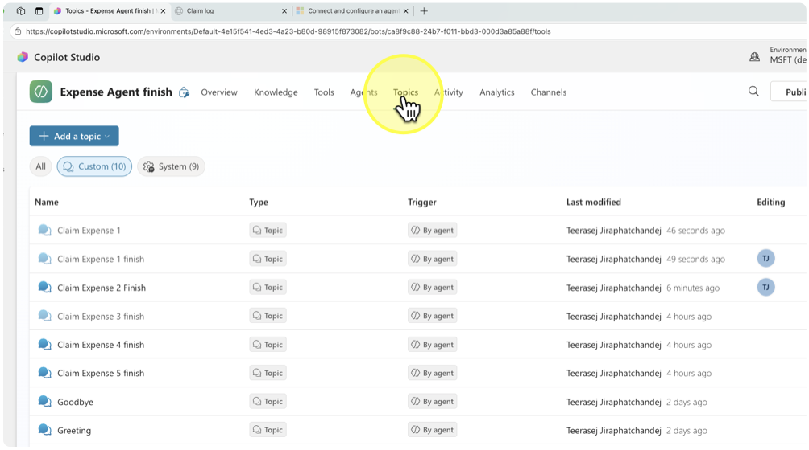
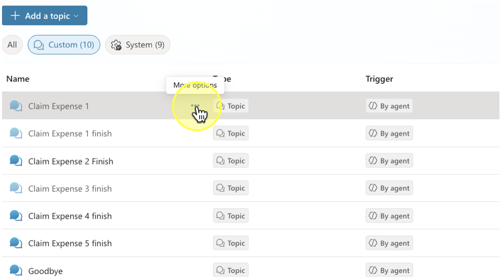
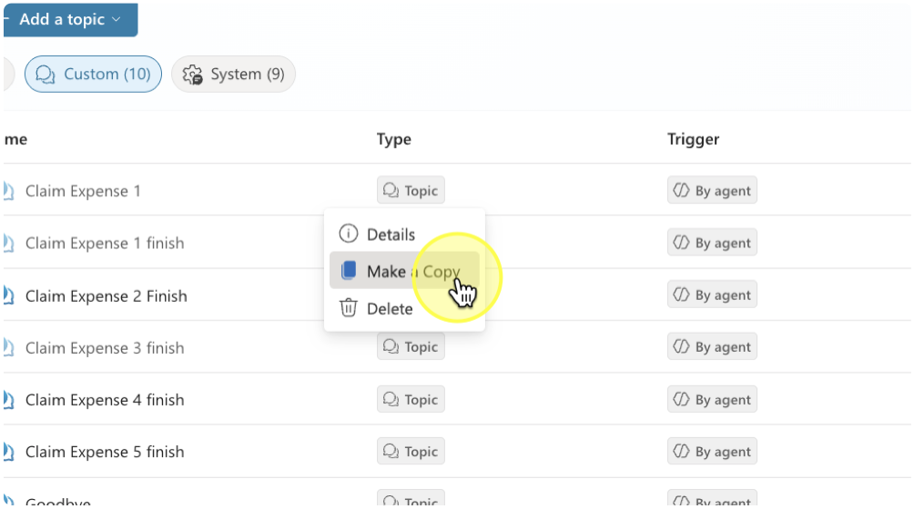
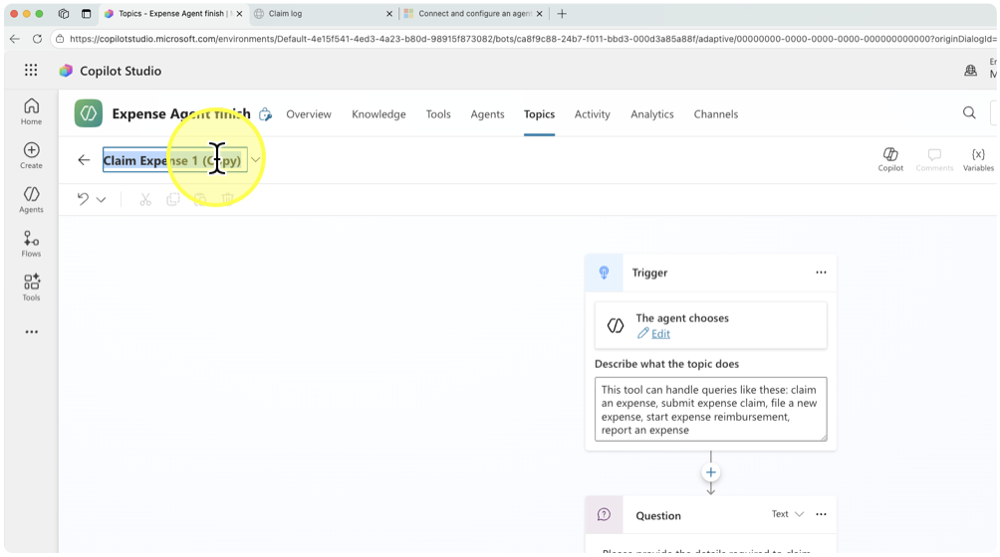
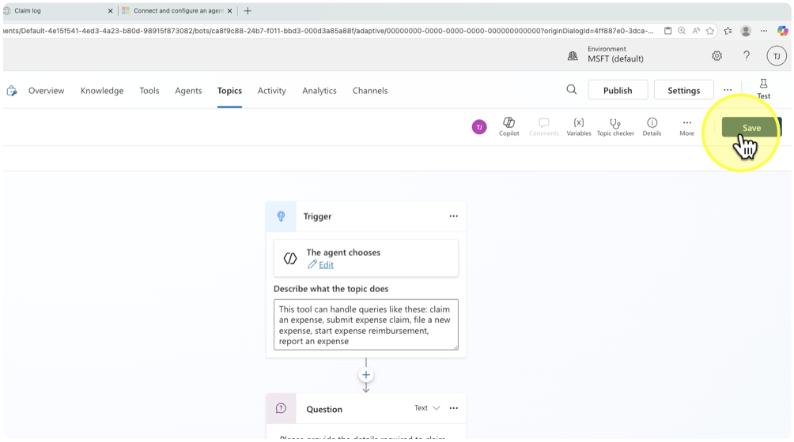

# Claim Expense 2: Duplicate a topic

## ขั้นตอนการทำสำเนา (Duplicate) Topic

### 1. จาก Expense Agent ที่เปิดแก้ไขอยู่ ให้เลือก topic จากเมนูด้านบน 
 
### 2. กดปุ่ม more option \(…\) ด้านขวาของ topic ที่ต้องการทำสำเนา 
 
### 3. เลือกคำสั่ง Make a copy 
 
### 4. หลังจากได้ topic ใหม่แล้ว คลิกที่ชื่อ Topic ด้านบนขวา และเปลี่ยนชื่อตามที่ต้องการ 
 
### 5. กดปุ่ม Save เพื่อบันทึกการตั้งชื่อ และพร้อมแก้ไขต่อเติม topic 
 