# การใช้ conditional node เพื่อแยก flow ตามคำตอบของผู้ใช้


#### 1. จากด้านล่างสุดของ Topic คลิกปุ่ม + เพื่อเพิ่ม node ใหม่<br>
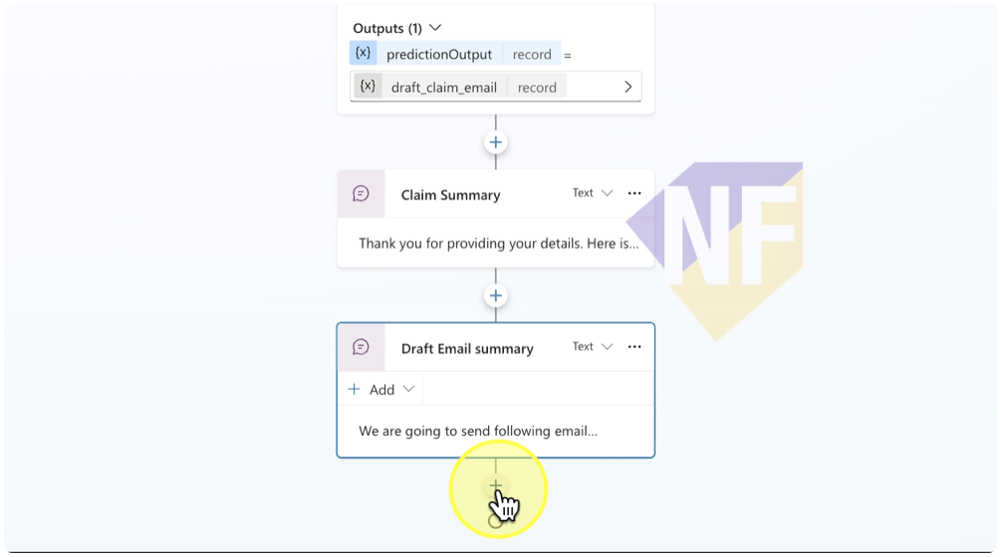<br>
#### 2. เลือก Ask a question node<br>
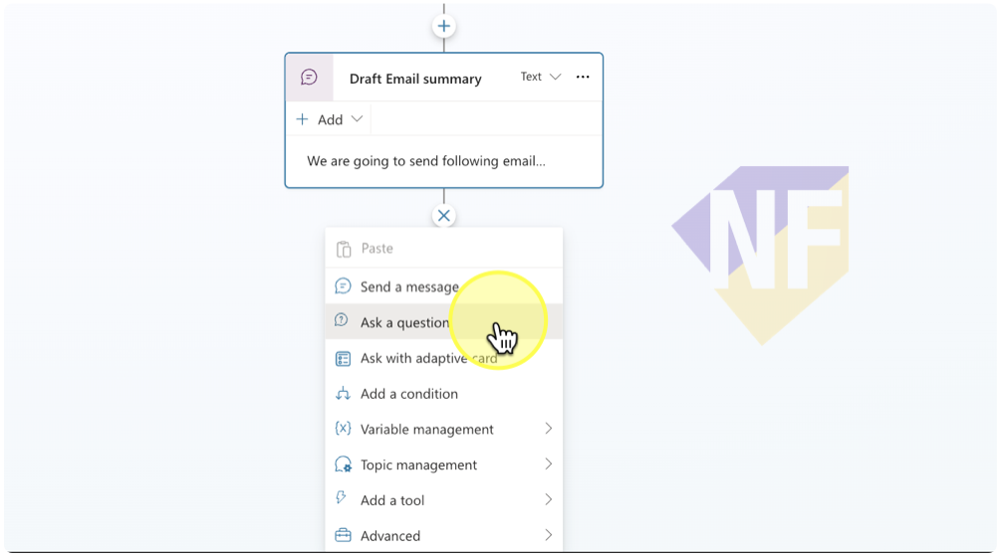<br>
#### 3. คลิกเข้าไปใน Draft Email Summary Node เพื่อคัดลอกข้อความมาวางไว้ใน Question Node<br>
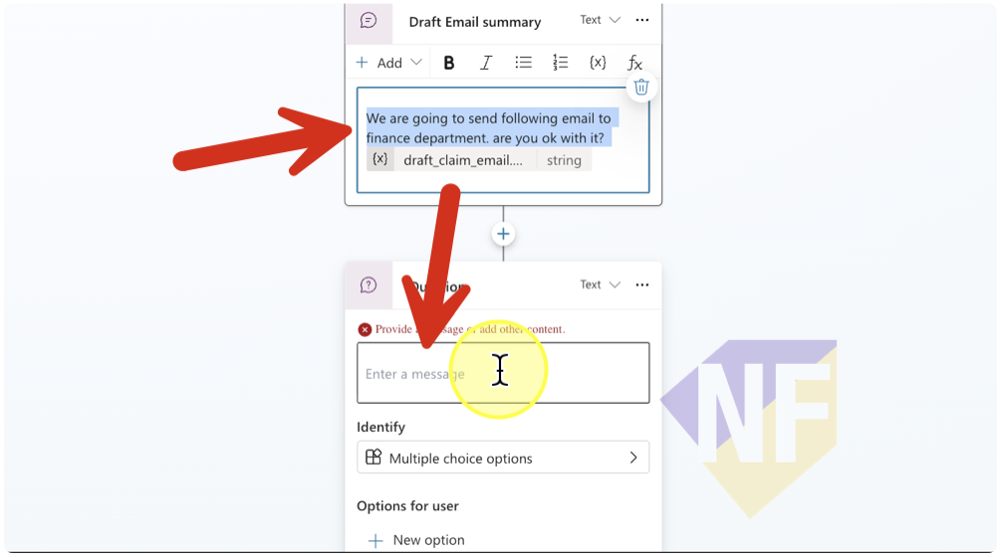<br>
#### 4. คลิกปุ่ม (...) ที่ Draft Email Summary Node และเลือก Delete<br>
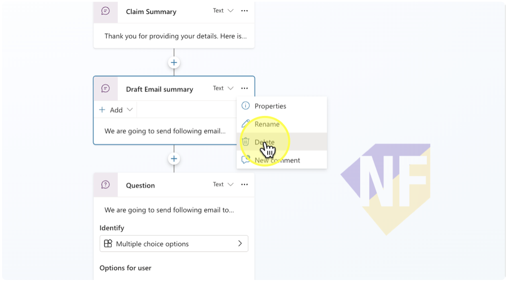<br>
#### 5. คลิกที่ชื่อ Question Node และเปลี่ยนชื่อเป็น Confirm Sending Email<br>
```
Confirm Sending Email
```
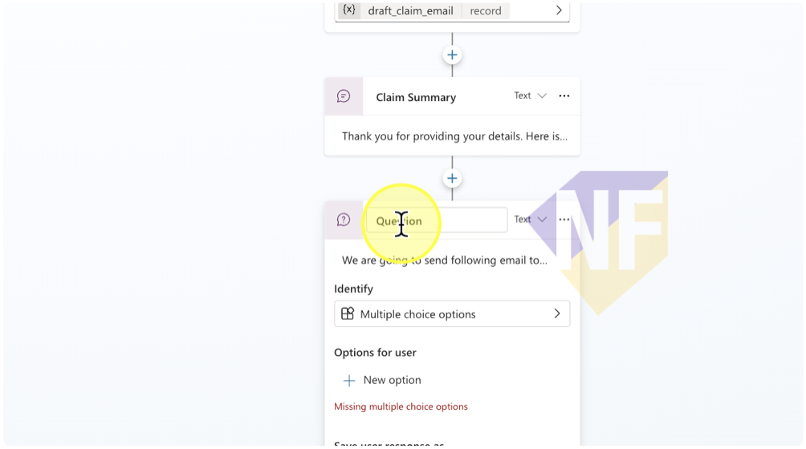<br>
#### 6. ให้แน่ใจว่าได้เลือก identify เป็น Multiple choice option และกดเพิ่มตัวเลือก New option และเพิ่มตัวเลือก “Yes” และ “No” ตามลำดับ<br>
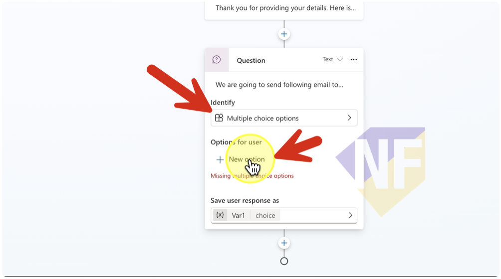<br>
#### 7. กดเปิดตัวแปรในช่อง Save user response as เพื่อเปลี่ยนชื่อตัวแปร โดยสังเกตว่าจะมี flow สร้างมาสำหรับตัวเลือกแต่ละตัวใน Question node<br>
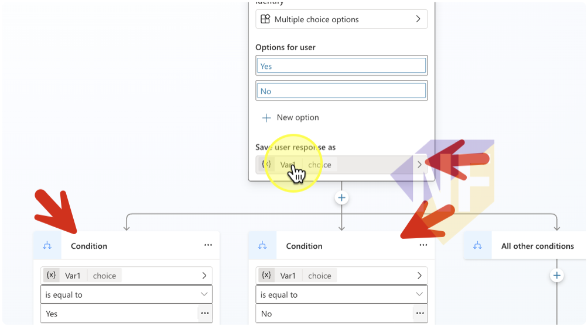<br>
#### 8. คลิกในช่อง Variable Name เพื่อตั้งชื่อตัวแปรว่า confirm_send_email และกด enter<br>
```
confirm_send_email
```
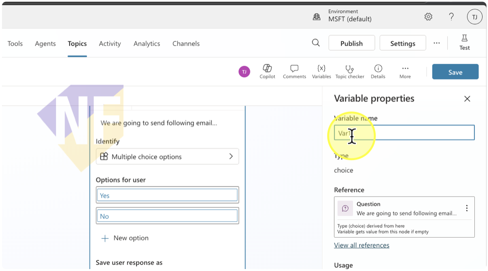<br>
#### 9. สังเกตตัวเลือก condition ที่มีการเทียบค่าตัวแปร confirm_send_email เป็น Yes ให้กดสร้าง node ใหม่<br>
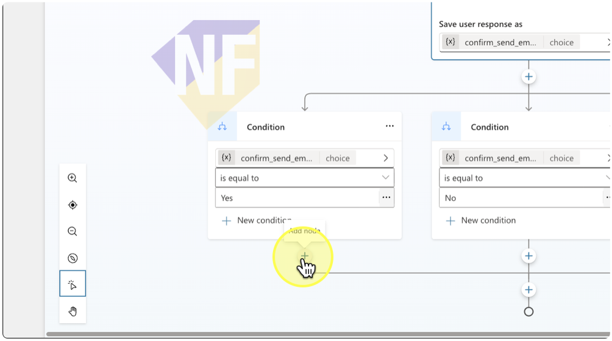<br>
#### 10. เลือก "Send a message"<br>
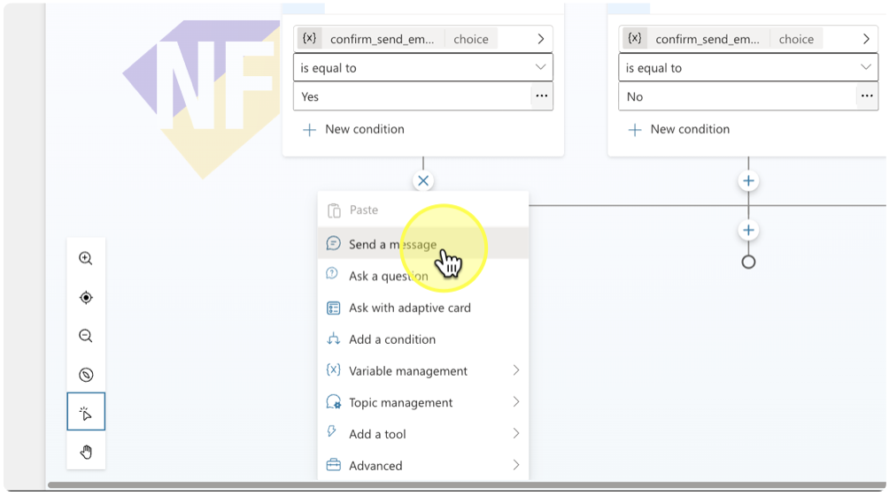<br>
#### 11. กรอกข้อความว่า “Email sent! 🎉”<br>
```
Email sent! 🎉
```
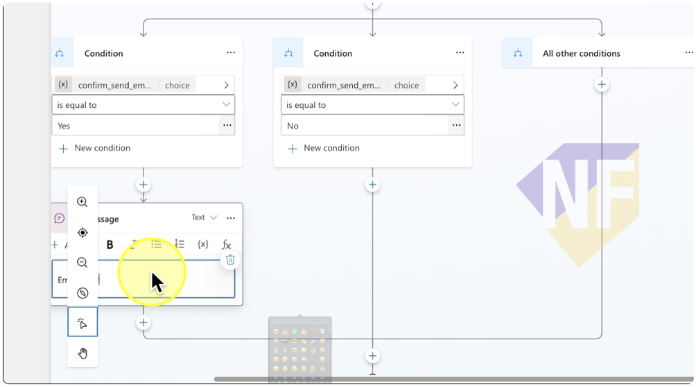<br>
#### 12. สังเกตตัวเลือก condition ที่มีการเทียบค่าตัวแปร confirm_send_email เป็น No ให้กดสร้าง node ใหม่<br>
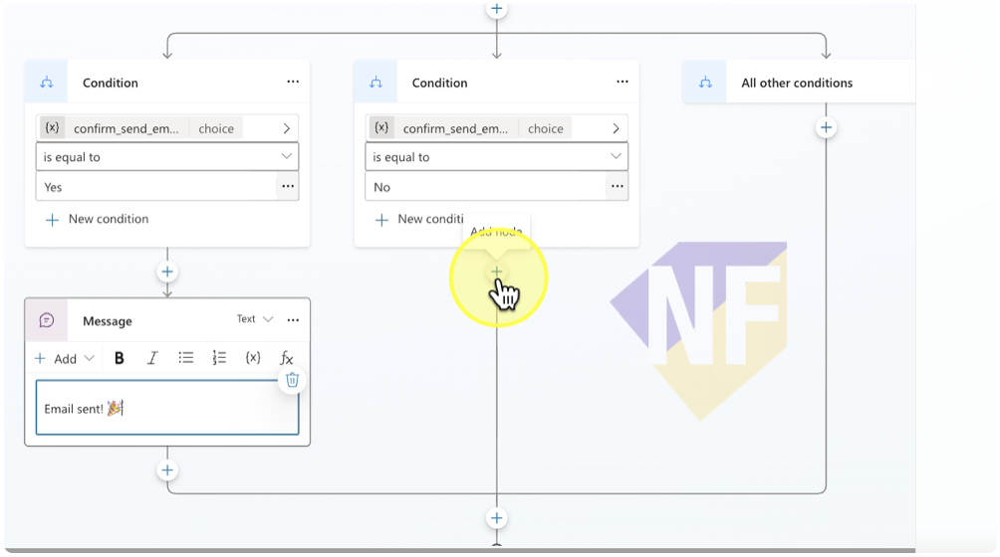<br>
#### 13. เลือก "Send a message"<br>
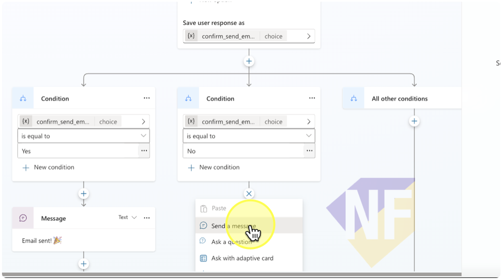<br>
#### 14. กรอกข้อความด้านล่าง เพื่อแจ้งการยกเลิกการเคลม<br>
```
Ok, I will cancel this claim. Tell me again if you want to start new claim.
```
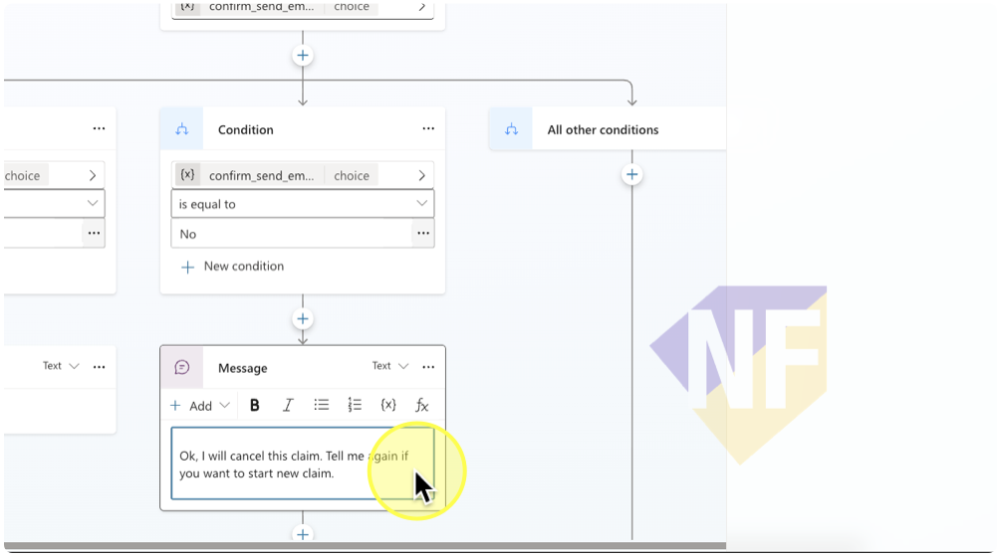<br>
#### 15. กดปุ่ม "Save" และทดสอบการทำงาน<br>
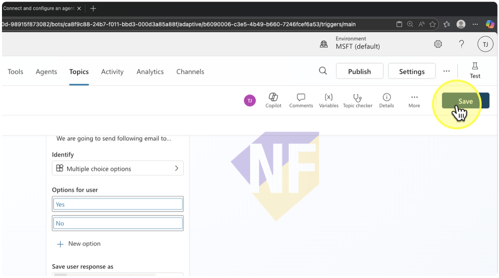<br>

## การทำงานที่คาดไว้

เมื่อผู้ใช้มาถึงจุดนี้ใน Topic flow 
- จะมีการถามให้แจ้งรายละเอียดในการเคลม
- ระบบจะนำรายละเอียดที่ได้รับมาไปสร้างร่างอีเมลโดยใช้ Prompt tool node
- ระบบจะแสดงข้อความสรุปอีเมลที่ร่างขึ้นมาให้ผู้ใช้ตรวจสอบก่อนส่งจริง 
- จากนั้นจะถามยืนยันว่าต้องการส่งอีเมลนี้หรือไม่ หากผู้ใช้ตอบว่า "Yes" ระบบจะแจ้งว่าส่งอีเมลเรียบร้อยแล้ว
- ระบบจะแจ้งว่าส่งอีเมลเรียบร้อยแล้ว แต่ถ้าผู้ใช้ตอบว่า "No" ระบบจะยกเลิกการเคลมและรอคำสั่งใหม่จากผู้ใช้