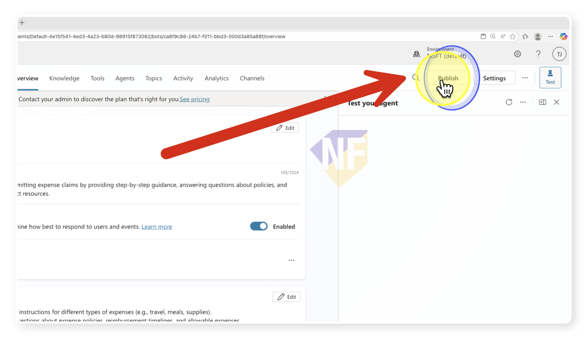
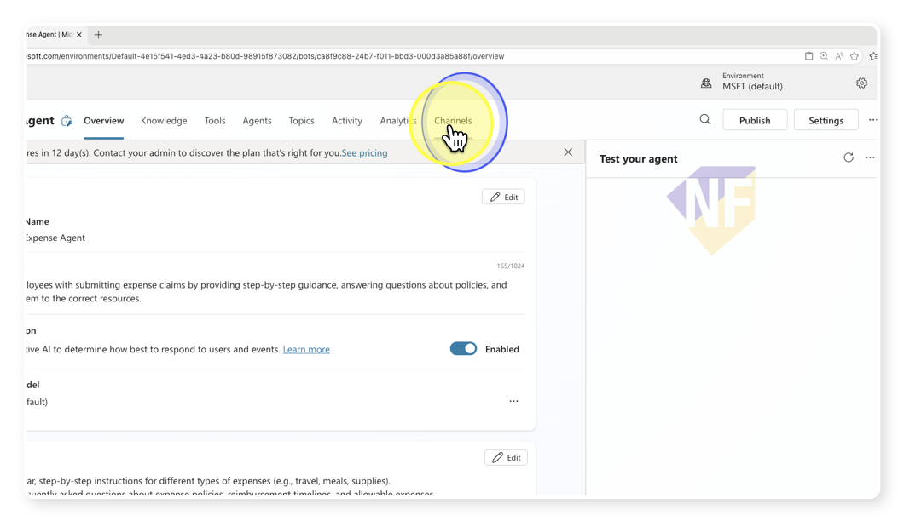
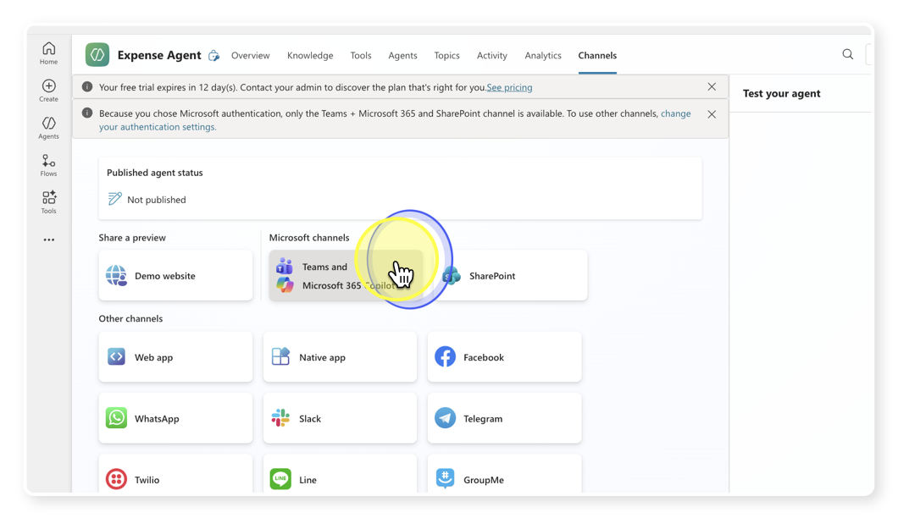
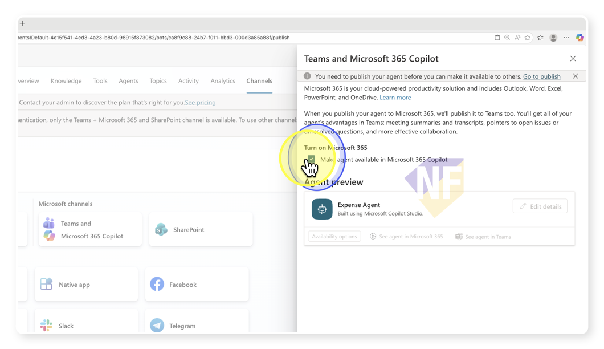
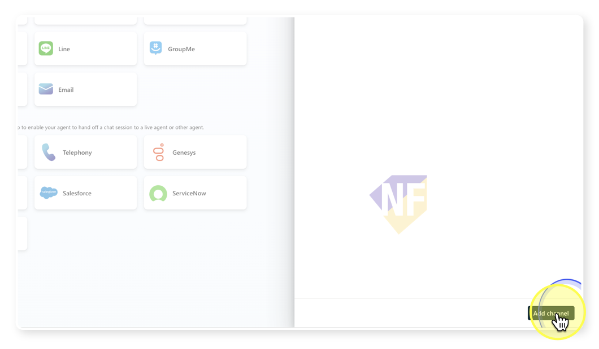

# Part 3: Publish my agent to Live!

## ขั้นตอน

1. **เปิด Copilot Studio Portal**
	 - เปิดเว็บเบราว์เซอร์ของคุณ แล้วไปที่ Copilot Studio portal (เช่น https://copilotstudio.microsoft.com)
	 - ลงชื่อเข้าใช้ด้วยบัญชีที่ใช้สร้าง agent ไว้ก่อนหน้านี้
	 - อย่าลืมให้แน่ใจว่า เราได้เลือก environment ที่สร้าง Agent ไว้ก่อนหน้านี้ (ถ้ามีหลาย environment)

2. **กดปุ่ม Publish ด้ายขวาบนของ Agent**
   - ดำเนินการตามขั้นตอนให้เรียบร้อย
    

3. **จากเมนูด้านบนของ Agent เลือกช่องทางการใช้งาน (Channels)**
   

4. **เลือกช่องทาง Teams and Microsoft 365 Copilot**
   

5. **กดปุ่ม Enable เพื่อเปิดใช้งาน Agent ใน Microsoft Teams และ Microsoft 365 Copilot**
   

6. เราสามารถตั้งค่าของ Agent ได้จากปุ่ม Edit details
7. กดปุ่ม Add Channel 
   

## ความรู้เสริม

- Channel ต่างๆ มีรูปแบบการตั้งค่าและการเผยแพร่ที่แตกต่างกันไป ขึ้นอยู่กับข้อกำหนดของแต่ละช่องทาง เช่นการใช้งานผ่าน Teams และ Microsoft 365 Copilot ต้องมีการตั้งค่า Settings > Security > Authentication > Authenticate with Microsoft 