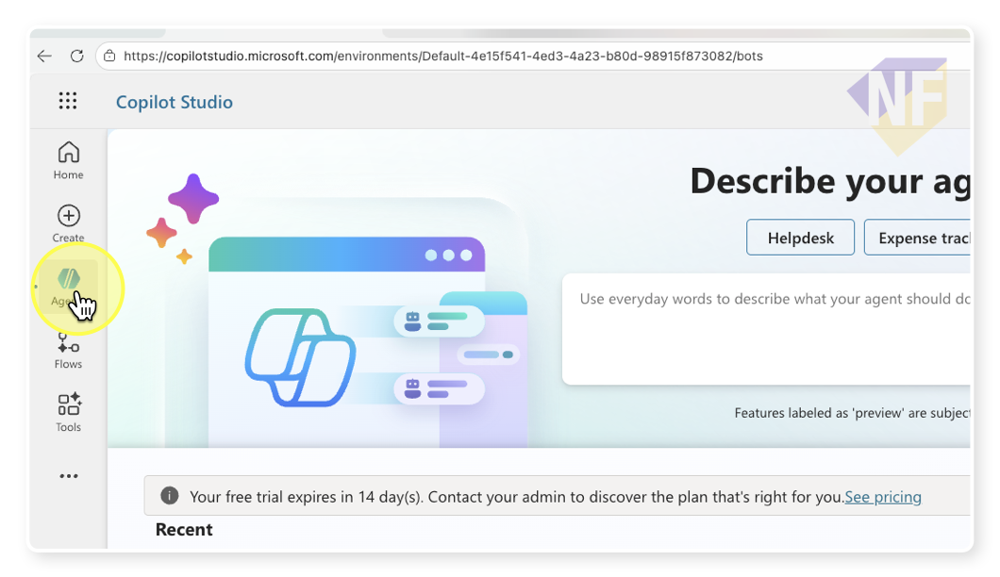
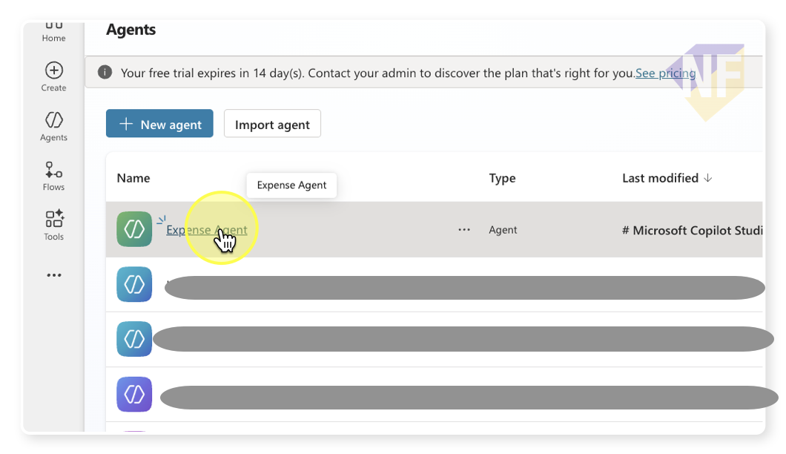
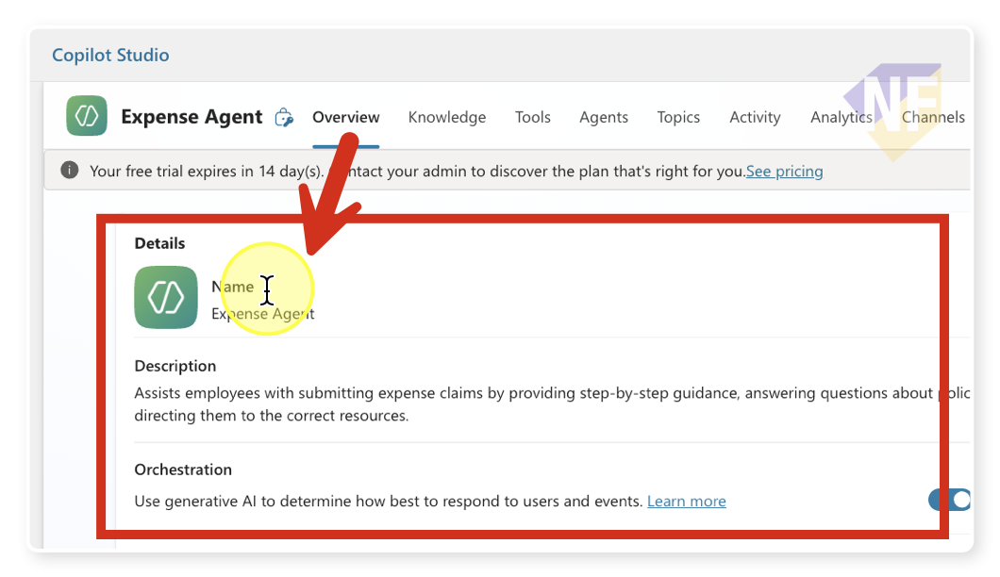
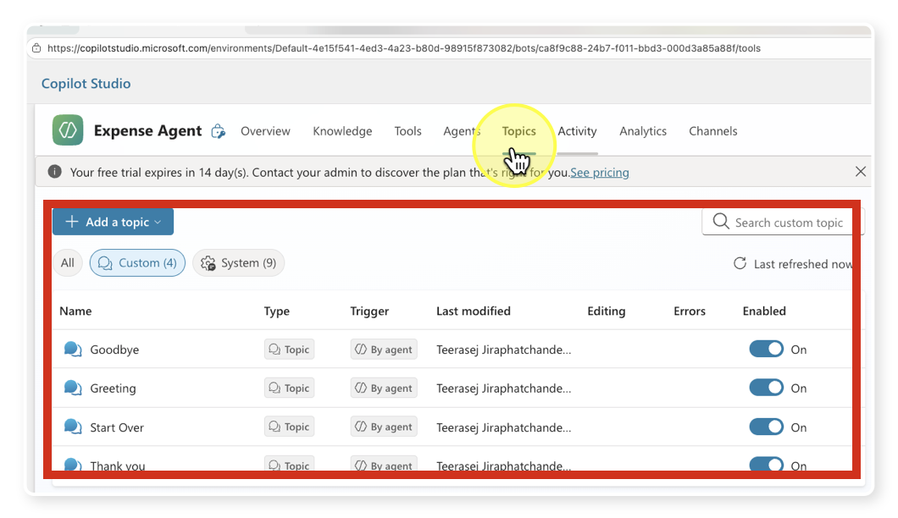
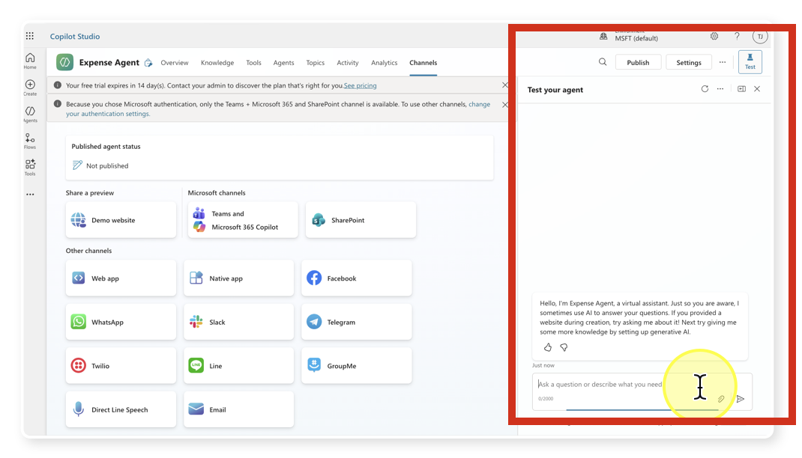

# สำรวจส่วนการจัดการ Agent

## ขั้นตอน

1. **เปิด Copilot Studio Portal**
	 - เปิดเว็บเบราว์เซอร์ของคุณ แล้วไปที่ Copilot Studio portal (เช่น https://copilotstudio.microsoft.com)
	 - ลงชื่อเข้าใช้ด้วยบัญชีที่ใช้สร้าง agent ไว้ก่อนหน้านี้
	 - อย่าลืมให้แน่ใจว่า เราได้เลือก environment ที่สร้าง Agent ไว้ก่อนหน้านี้ (ถ้ามีหลาย environment)

2. **เข้าสู่เมนู 'Agents'**
	 - ที่แถบเมนูด้านซ้ายมือ ให้คลิกที่ **Agents** เพื่อแสดงรายชื่อ agent ทั้งหมดในระบบ

  

1. **เลือก Agent ที่คุณสร้างไว้**
	 - ค้นหา agent ที่คุณสร้างไว้จากแบบฝึกหัดก่อนหน้า (เช่น "Expense Agent")
	 - คลิกที่ชื่อ agent เพื่อเข้าสู่หน้าจัดการ agent
  

2. **สำรวจแต่ละส่วนของ Agent**
	 - ที่ด้านบนของหน้า agent จะมีเมนูย่อย เช่น **Overview**, **Knowledge**, **Tools**, **Settings** ฯลฯ
	 - คลิกเข้าไปดูแต่ละส่วนเพื่อสำรวจรายละเอียด ดังนี้:
		 - **Overview**: 
			 - แสดงข้อมูลสรุป agent เช่น ชื่อ, สถานะ (เปิด/ปิด), รายละเอียด, instruction
			 
		 - **Knowledge**: 
			 - แสดงรายการแหล่งข้อมูลที่เชื่อมต่อกับ agent เช่น ไฟล์เอกสาร, URL, หรือฐานข้อมูล
			 - สามารถเพิ่ม/ลบ/แก้ไขแหล่งข้อมูลสำหรับการทำงานของ Agent ได้จากหน้านี้
         - **Tools**: 
			 - แสดงเครื่องมือหรือ integration ที่ agent สามารถใช้งาน เช่น API, plugins, หรือการเชื่อมต่อกับบริการภายนอก
			 - ตรวจสอบสถานะการเชื่อมต่อและตั้งค่าการใช้งานแต่ละเครื่องมือ
		 - **Topics**:
			 - กำหนดหัวข้อ (topic) หรือกลุ่มคำถามที่ agent สามารถโต้ตอบแบบเจาะจงได้
			 - สามารถเพิ่ม/ลบ/แก้ไข topic เพื่อควบคุมขอบเขตการสนทนาและปรับแต่งประสบการณ์ผู้ใช้
			 - ตัวอย่างเช่น สร้าง topic "การเบิกค่าใช้จ่าย" หรือ "ข้อมูลบริษัท"
            
		 - **Activity**:
			 - แสดงประวัติการใช้งาน agent เช่น รายการสนทนา คำถามที่ถูกถามบ่อย หรือกิจกรรมล่าสุด
			 - ใช้สำหรับตรวจสอบการทำงานย้อนหลังและวิเคราะห์ปัญหาที่เกิดขึ้น
		 - **Analytic**:
			 - แสดงสถิติการใช้งาน agent เช่น จำนวนผู้ใช้ จำนวนข้อความที่ตอบกลับ อัตราความสำเร็จในการตอบคำถาม
			 - สามารถดูแนวโน้มการใช้งานและประสิทธิภาพของ agent ได้จากหน้านี้
		 - **Channels**:
			 - ใช้สำหรับเผยแพร่ (publish) agent ของคุณไปยังช่องทางต่าง ๆ เช่น Microsoft Teams, เว็บไซต์, Facebook, Line หรือช่องทางอื่น ๆ ที่รองรับ
			 - สามารถตั้งค่าการเชื่อมต่อ เลือกเปิด/ปิดการเผยแพร่ในแต่ละช่องทาง และดูสถานะการเผยแพร่ได้จากหน้านี้

		 - **Settings** (ถ้ามี):
			 - ปรับแต่งค่าทั่วไปของ agent เช่น ภาษา, รูปแบบการตอบกลับ, การตั้งค่าความปลอดภัย
		 - **Test Panel**: 
			 - ที่ด้านขวาของหน้าจอ จะมี test panel ให้ทดลองสนทนากับ agent
			 - พิมพ์ข้อความหรือคำถามเพื่อดูตัวอย่างการตอบกลับของ agent แบบเรียลไทม์
			 - สามารถเปลี่ยน context หรือปรับแต่ง input เพื่อทดสอบการทำงานในสถานการณ์ต่าง ๆ
            

3. **กลับไปที่ Overview**
	 - หลังจากสำรวจและทดสอบ agent ในแต่ละส่วนแล้ว ให้กลับไปที่ **Overview**
	 - ทบทวนข้อมูลสรุป agent และตรวจสอบสถานะการทำงานอีกครั้ง

