ในแบบฝึกหัดนี้ คุณจะได้เรียนรู้วิธีการส่งออก Copilot Studio agent ของคุณเป็นส่วนหนึ่งของ Power Platform solution กระบวนการนี้จะช่วยให้คุณสามารถสำรองข้อมูล agent, ควบคุมเวอร์ชัน และกู้คืนหรือติดตั้งไปยัง environment อื่นๆ ได้

## ทำไมต้องส่งออก Agent เป็น Solution?

- **การสำรองและกู้คืน**: สร้างไฟล์สำรองของการตั้งค่า agent
- **การควบคุมเวอร์ชัน**: จัดการเวอร์ชันต่างๆ ของ agent
- **การย้าย Environment**: ย้าย agent ระหว่าง development, testing และ production environments
- **การทำงานร่วมกันในทีม**: แชร์การตั้งค่า agent กับสมาชิกในทีม
- **การกู้คืนจากภาวะฉุกเฉิน**: กู้คืน agent อย่างรวดเร็วเมื่อจำเป็น

## สิ่งที่ต้องเตรียมก่อนเริ่มต้น

- ทำแบบฝึกหัดการสร้าง agent เสร็จแล้ว
- มีสิทธิ์เข้าถึง Microsoft Copilot Studio
- มีสิทธิ์ที่เหมาะสมในการส่งออก solution ใน Power Platform environment ของคุณ

## ขั้นตอนการฝึกปฏิบัติ

### ส่วนที่ 1: เตรียม Agent ของคุณสำหรับการส่งออก

1. **เปิด Copilot Studio**
   - ไปที่ [Copilot Studio](https://copilotstudio.microsoft.com)

2. **เลือก Agent ของคุณ**
   - จากหน้าหลัก คลิกเปิดเมนูแสดง agent ทั้งหมด
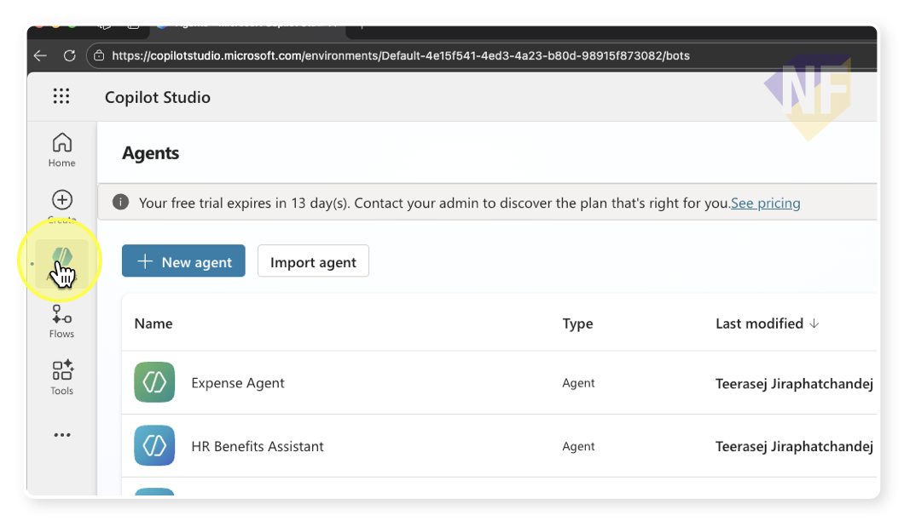
   - ตรวจสอบให้แน่ใจว่าการเปลี่ยนแปลงล่าสุดทั้งหมดถูกบันทึกแล้ว

3. **เปิดเมนูเพิ่มเติม**
   - กดปุ่มแสดง action เพิ่มเติม (สามจุด) ข้างชื่อ agent ของคุณ
  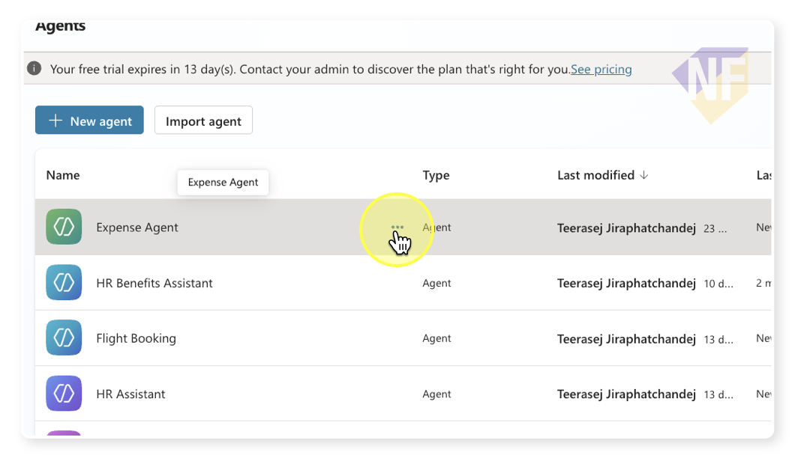
  - เลือกคำสั่ง Export Agent
  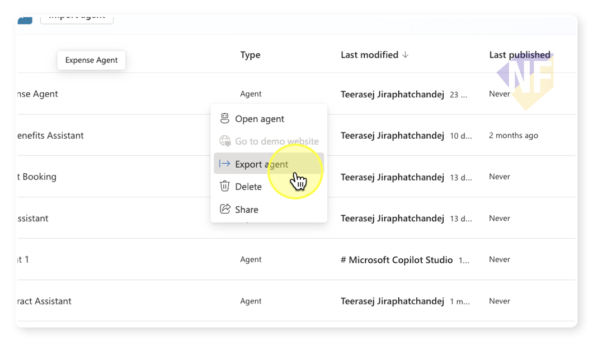

### ส่วนที่ 2: เพิ่ม Agent เข้าไปใน Solution

1. **สร้าง Solution สำหรับใช้เป็นที่เก็บ Agent (ถ้ายังไม่มี)**
   - ใน Copilot Studio คลิกปุ่ม **New Solution**
  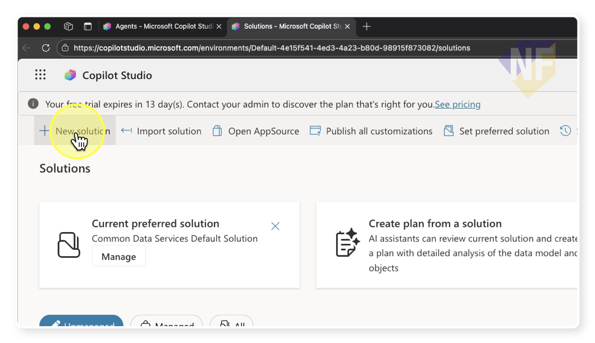
   - กรอกชื่อ Name และ Display Name ของ solution จากนั้นกดปุ่ม New Publisher เพื่อสร้างข้อมูลของ Publisher ที่จะแสดงใน Solution เวลานำไปใช้งานใน Environment อื่น
  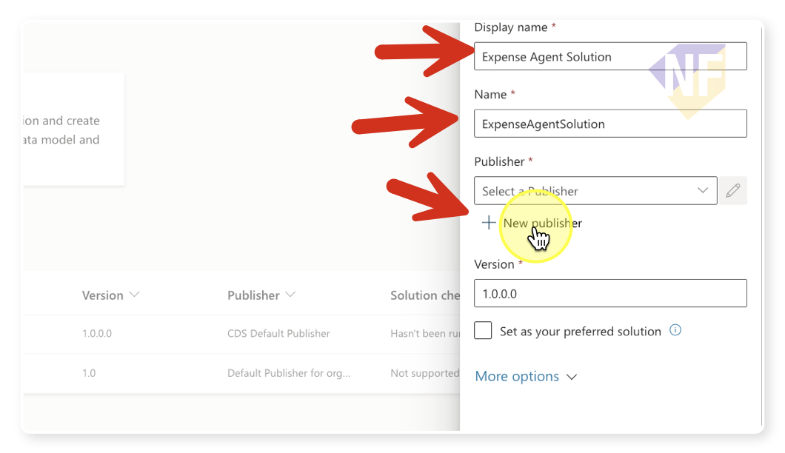
   - กรอกข้อมูล Publisher ตามนี้
      - Name: **Nextflow**
      - Prefix: **nfagent**
      - กดปุ่ม **Save**
  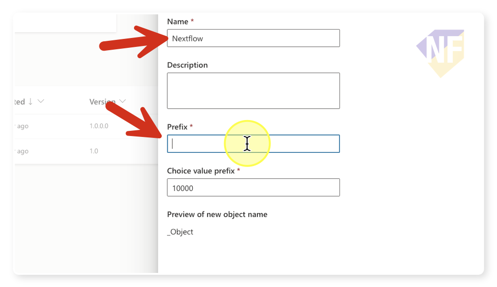
    - กลับมาที่หน้าสร้าง Solution ให้ เช็คให้แน่ใจว่าเลือก Publisher ที่สร้างไว้แล้ว
  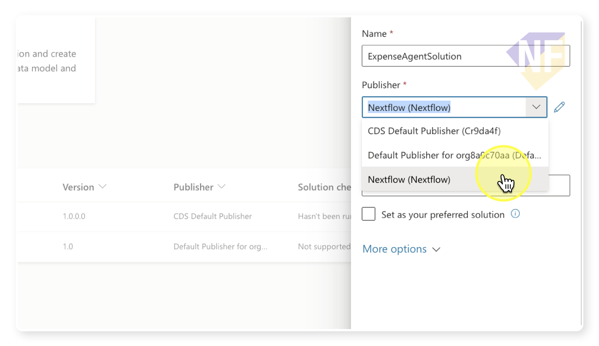
    - กำหนดเลขเวอร์ชั่น และกดปุ่ม **Create** เพื่อสร้าง Solution
  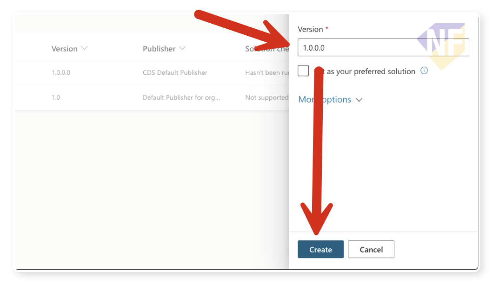

1. **เพิ่ม Agent เข้าไปใน Solution**
   - หลังจากสร้าง Solution แล้ว เราจะเพิ่ม Agent ของเราเข้าไป ให้กดปุ่ม **Add existing** ในหน้ารายละเอียด Solution
  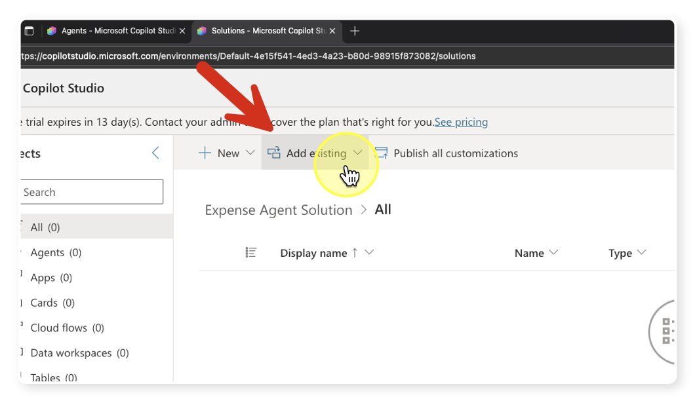
   - เลือก **Agent** จากเมนู > Agent 
  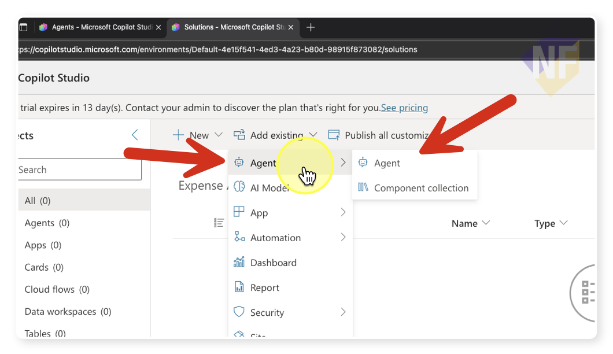
   - เลือก Agent ที่ต้องการเพิ่มเข้าไปใน Solution 
  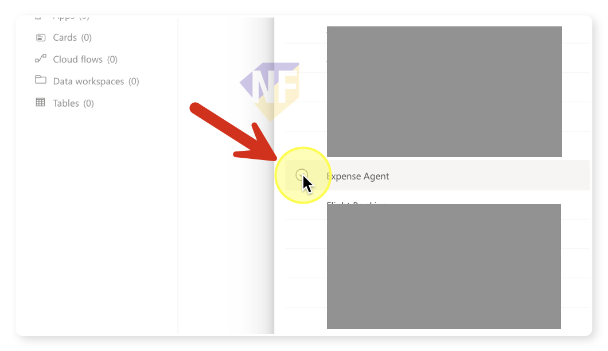
    - กดปุ่ม **Add** เพื่อเพิ่ม Agent เข้าไปใน Solution
  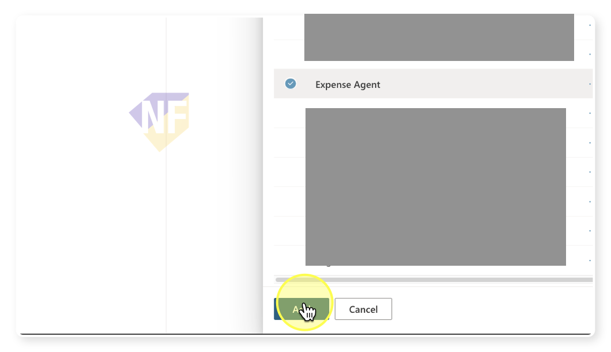

3. **ยืนยันการเพิ่ม Agent โดยกดปุ่ม Publish All Customizations (จะใช้เวลาประมาณหนึง)**
  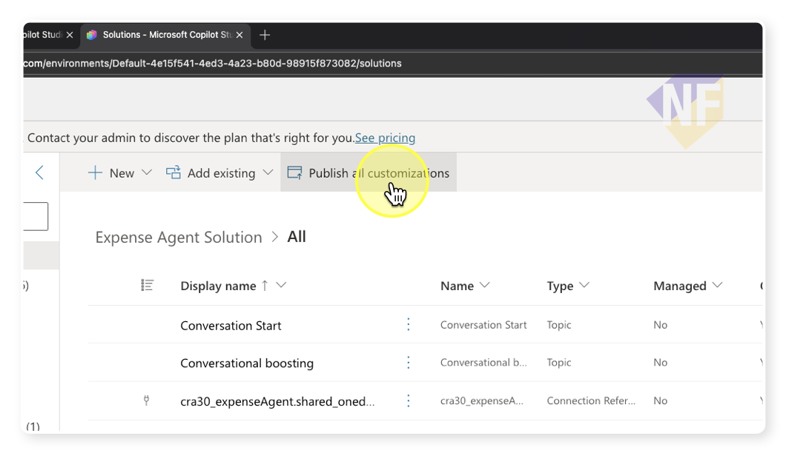
  - ถ้าการ Publish สำเร็จ จะมีข้อความสีเขียวแจ้งเตือนขึ้นมาด้านบน ให้กดปุ่ม **Oveview** จากเมนูด้านซ้ายของ Solution
  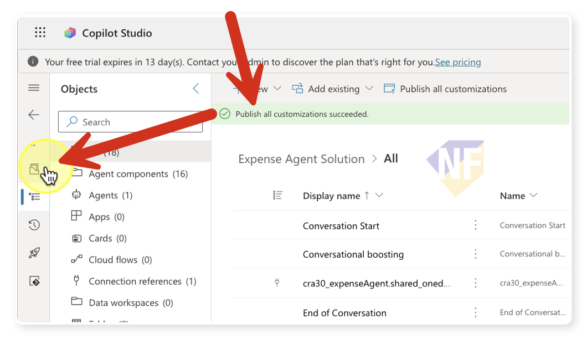

### ส่วนที่ 3: Export Solution

1. **จากหน้า Overview เลือก Solution ของคุณ**
   - กดปุ่ม **Export** ที่แถบคำสั่งด้านบน
   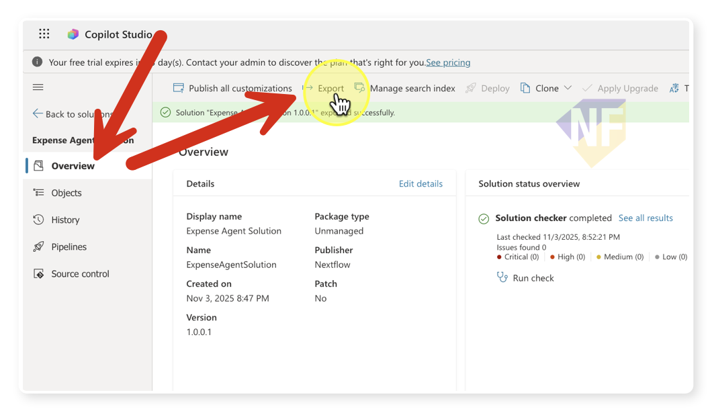
   
2. **เช็คว่า publish ทุกอย่างแล้ว**
   - ระบบจะเตือนให้ publish ก่อน เพื่อให้แน่ใจว่าส่วนประกอบทั้งหมดเป็นการแก้ไขล่าสุด
    - รอจนกว่าการ publish จะเสร็จสมบูรณ์ แล้วกดปุ่ม **Export** อีกครั้ง
    - ถ้าแน่ใจว่าทุกอย่าง publish แล้ว ให้กดปุ่ม **Next** เพื่อไปขั้นตอนถัดไป
   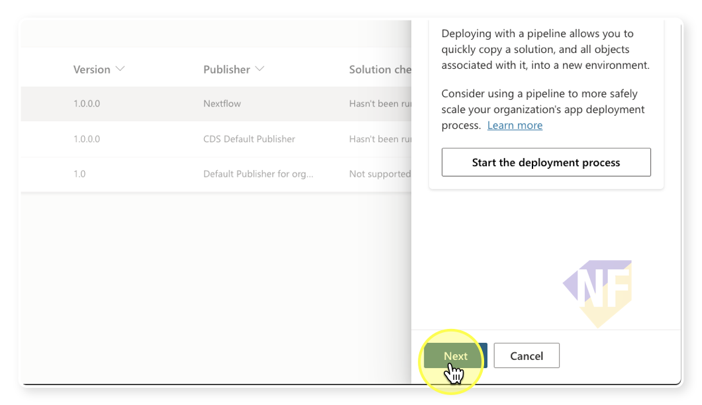
    

3. **ส่งออกแบบ Managed หรือ Unmanaged**
   - เลือกประเภทการส่งออก แบบ **Unmanaged**: สำหรับการพัฒนาและปรับแต่งต่อเนื่อง
       - ใช้สำหรับการสำรองและย้ายระหว่าง dev/test environments
       - อนุญาตให้แก้ไขหลังจาก import เข้า environment ใหม่
  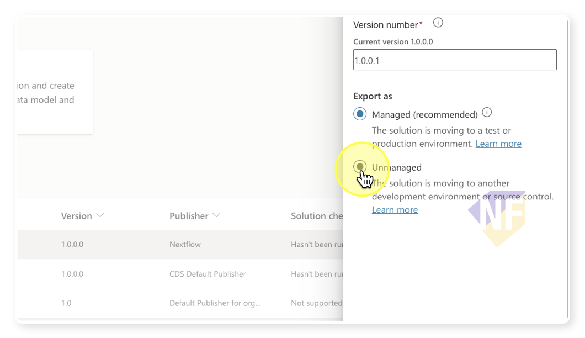
    > - **Managed**: สำหรับการติดตั้งใช้งานจริง
    >    - ใช้สำหรับการติดตั้งไปยัง production environments
    >    - ป้องกันการแก้ไข (ทำหน้าที่เป็นแพ็คเกจที่ปิดผนึก)

4. **ตัวเลือกตรวจสอบความผิดพลาดเบื้องต้นของ Solution**
   - เราสามารถเลือกเปิดการตรวจสอบความผิดพลาดเบื้องต้น ของ Solution ได้ (Run solution checker)
   - กดปุ่ม Export เพื่อดำเนินการส่งออก solution ได้เลย
  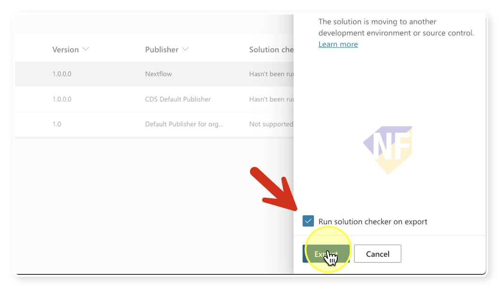

5. **ดาวน์โหลดไฟล์ Solution**
   - รอให้กระบวนการส่งออกเสร็จสมบูรณ์ (ปกติใช้เวลาหลายนาที)
   - คลิก **Download** เมื่อการส่งออกพร้อมแล้ว
   - solution จะถูกดาวน์โหลดเป็นไฟล์ `.zip`
   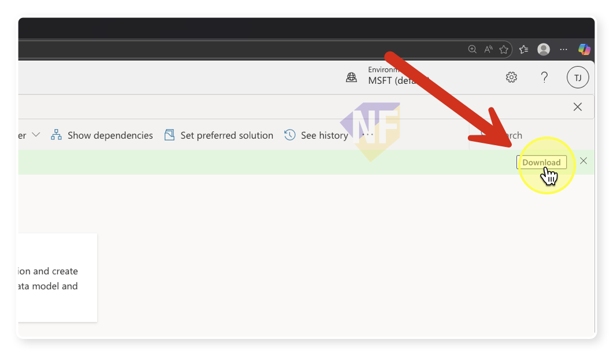

