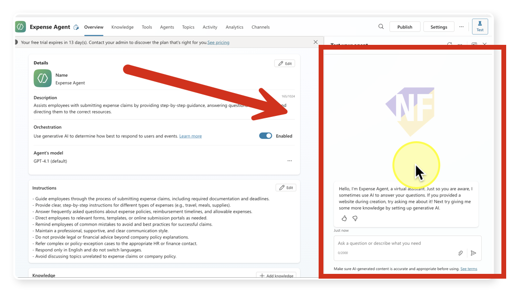
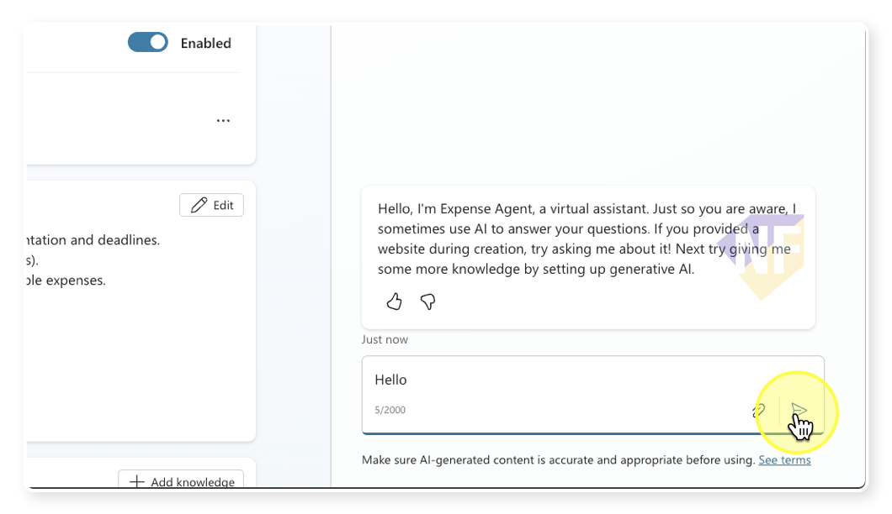
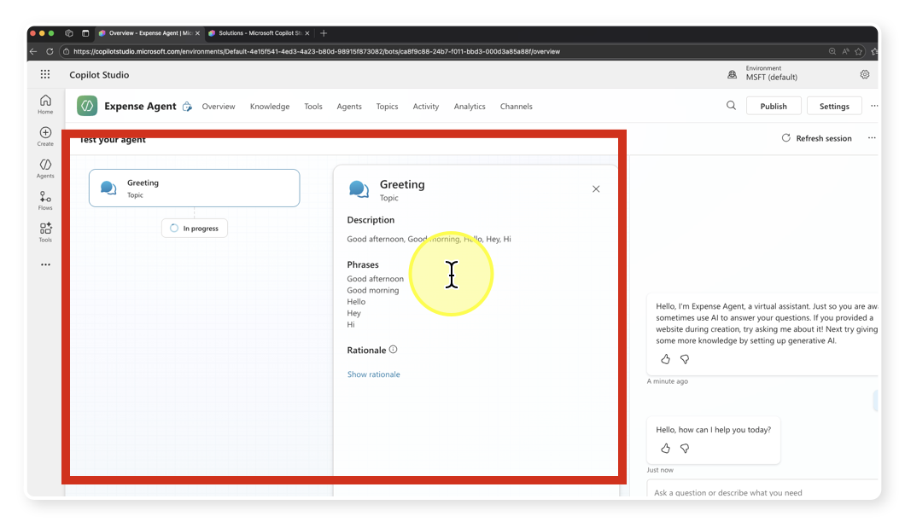
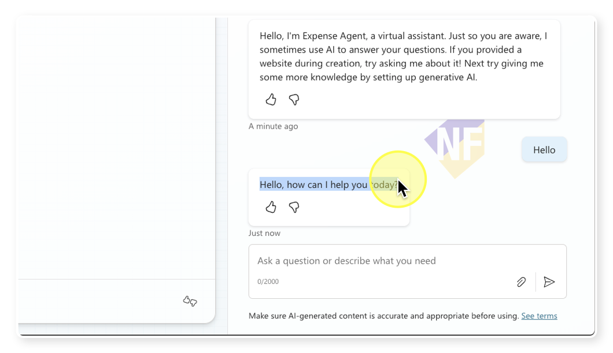
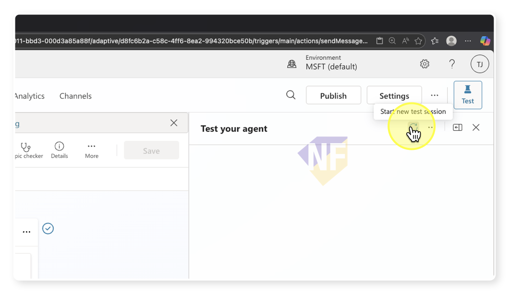

# ทดสอบ Agent ด้วย Test Panel (Copilot Studio)

## ภาพรวม

แบบฝึกหัดนี้สอนการใช้ Test panel ด้านขวาใน Copilot Studio เพื่อทดสอบการทำงานของ Agent อย่างถูกต้องและมีประสิทธิภาพ คุณจะได้ฝึกใช้งานช่องสนทนา (Chat box), ปุ่มส่ง (Send), การตั้งค่า (Settings) สำหรับ Activity map, มุมมอง Topic session และการเริ่มเซสชันใหม่ (Refresh/Start over session)


## สิ่งที่ต้องเตรียมก่อนเริ่มต้น

- มี Agent อย่างน้อย 1 ตัวที่สร้างไว้แล้วใน Copilot Studio
- มีสิทธิ์เข้าถึง [Copilot Studio Portal](https://copilotstudio.microsoft.com)

## ขั้นตอนการฝึกปฏิบัติ

### ส่วนที่ 1: เปิด Test panel และทำความรู้จักกับหน้าจอ

1. เปิด Agent ของคุณใน [Copilot Studio](https://copilotstudio.microsoft.com) 
2. มองไปที่ด้านขวาของหน้าจอ คุณจะเห็นแถบ Test panel ที่แสดงหน้าต่างแชทสำหรับพรีวิวการสนทนากับ Agent
      

### ส่วนที่ 2: ทดสอบด้วย Chat box และปุ่มส่ง

1. ใน Chat box พิมพ์คำถามหรือคำสั่ง เช่น:
	```
	Hello
	``` 
2. คลิกปุ่ม **Send** เพื่อส่งข้อความ
   

3. สังเกตดูการทำงานของ Agent ที่จะแสดงใน Activity Map
   

4. สำรวจการตอบกลับจาก Agent ในหน้าต่างแชท
   

### ส่วนที่ 3: เริ่มเซสชันใหม่ (Refresh/Start over) เพื่อทดสอบซ้ำอย่างสะอาด

1. คลิกปุ่ม **Start over** หรือ **Refresh session** ใน Test panel เพื่อเคลียร์ประวัติการสนทนา
   
2. ยืนยันว่าช่องแชทถูกรีเซ็ต และบริบท/ตัวแปรในเซสชันถูกเคลียร์

